# Certified Lean Six Sigma Green Belt (CLSSGB) Training — Learner Guide

**WSQ Course Code:** TGS-2025055775  |  **Conducted by:** Tertiary Infotech Academy Pte Ltd (UEN 201200696W)  |  **Version v4 · 19 July 2026**

## Contents

- [Introduction](#introduction)
- [Course Learning Outcomes](#course-learning-outcomes)
- [Skills Framework Alignment](#skills-framework-alignment)
- [Before You Start](#before-you-start)
- [FOUNDATIONS — Six Sigma Foundations & The Green Belt Role  (10%)](#foundations--six-sigma-foundations--the-green-belt-role--10)
  - [Lab 1 — The Green Belt Role, Project Selection and Business Case  [Core]](#lab-1--the-green-belt-role-project-selection-and-business-case--core)
  - [Lab 2 — Y = f(X), Sigma Level, DPMO and the DMAIC Roadmap  [Core]](#lab-2--y--fx-sigma-level-dpmo-and-the-dmaic-roadmap--core)
- [DEFINE — Define — Scope the Problem  (18%)](#define--define--scope-the-problem--18)
  - [Lab 3 — Voice of the Customer, Affinity Diagram and Kano Analysis  [Core]](#lab-3--voice-of-the-customer-affinity-diagram-and-kano-analysis--core)
  - [Lab 4 — CTQ Tree — Translating Customer Needs into Measurable Requirements  [Core]](#lab-4--ctq-tree--translating-customer-needs-into-measurable-requirements--core)
  - [Lab 5 — Project Charter, Problem Statement, Goal Statement and Scope  [Core]](#lab-5--project-charter-problem-statement-goal-statement-and-scope--core)
  - [Lab 6 — SIPOC, Stakeholder Analysis and RACI  [Core]](#lab-6--sipoc-stakeholder-analysis-and-raci--core)
- [MEASURE — Measure — Quantify Performance  (24%)](#measure--measure--quantify-performance--24)
  - [Lab 7 — Detailed Process Mapping and Swimlane Analysis  [Core]](#lab-7--detailed-process-mapping-and-swimlane-analysis--core)
  - [Lab 8 — Value Stream Mapping, Takt Time and the Eight Wastes  [Core]](#lab-8--value-stream-mapping-takt-time-and-the-eight-wastes--core)
  - [Lab 9 — Data Types, Operational Definitions and the Data Collection Plan  [Core]](#lab-9--data-types-operational-definitions-and-the-data-collection-plan--core)
  - [Lab 10 — Sampling Techniques and Sample Size Calculation  [Core]](#lab-10--sampling-techniques-and-sample-size-calculation--core)
  - [Lab 11 — Measurement System Analysis and Gage R&R  [Core]](#lab-11--measurement-system-analysis-and-gage-rr--core)
  - [Lab 12 — Yield, DPU, DPO, DPMO, RTY and the Hidden Factory  [Core]](#lab-12--yield-dpu-dpo-dpmo-rty-and-the-hidden-factory--core)
  - [Lab 13 — Descriptive Statistics, Normality and Baseline Process Capability  [Core]](#lab-13--descriptive-statistics-normality-and-baseline-process-capability--core)
- [ANALYZE — Analyze — Find and Prove the Root Cause  (26%)](#analyze--analyze--find-and-prove-the-root-cause--26)
  - [Lab 14 — Variation, Run Charts and Stability Analysis  [Core]](#lab-14--variation-run-charts-and-stability-analysis--core)
  - [Lab 15 — Pareto Analysis, Stratification and Boxplots  [Core]](#lab-15--pareto-analysis-stratification-and-boxplots--core)
  - [Lab 16 — Fishbone, 5 Whys, Multi-Voting and Cause Prioritisation  [Core]](#lab-16--fishbone-5-whys-multi-voting-and-cause-prioritisation--core)
  - [Lab 17 — Hypothesis Testing — Test Selection, p-values and Conclusions  [Core]](#lab-17--hypothesis-testing--test-selection-p-values-and-conclusions--core)
  - [Lab 18 — Correlation, Regression and Quantifying the X-Y Relationship  [Core]](#lab-18--correlation-regression-and-quantifying-the-x-y-relationship--core)
- [IMPROVE — Improve — Select, De-Risk and Pilot the Fix  (12%)](#improve--improve--select-de-risk-and-pilot-the-fix--12)
  - [Lab 19 — Solution Generation, Benchmarking and Brainwriting  [Core]](#lab-19--solution-generation-benchmarking-and-brainwriting--core)
  - [Lab 20 — Lean Countermeasures — 5S, Poka-Yoke, Pull, JIT and Standard Work  [Core]](#lab-20--lean-countermeasures--5s-poka-yoke-pull-jit-and-standard-work--core)
  - [Lab 21 — Solution Selection Matrix and Cost-Benefit Analysis  [Core]](#lab-21--solution-selection-matrix-and-cost-benefit-analysis--core)
  - [Lab 22 — FMEA, Risk Priority Numbers, DOE and Piloting  [Core]](#lab-22--fmea-risk-priority-numbers-doe-and-piloting--core)
- [CONTROL — Control — Hold the Gain  (10%)](#control--control--hold-the-gain--10)
  - [Lab 23 — Statistical Process Control — Chart Selection and Control Limits  [Core]](#lab-23--statistical-process-control--chart-selection-and-control-limits--core)
  - [Lab 24 — Control Plan, SOP, Visual Management and Response Plan  [Core]](#lab-24--control-plan-sop-visual-management-and-response-plan--core)
  - [Lab 25 — Verify the Gain, A3 Storyboard, Handover and Project Closure  [Core]](#lab-25--verify-the-gain-a3-storyboard-handover-and-project-closure--core)
- [Quick Reference — Formulas You Should Know](#quick-reference--formulas-you-should-know)
- [Quick Reference — The Eight Wastes (DOWNTIME)](#quick-reference--the-eight-wastes-downtime)
- [Preparing for the Assessment](#preparing-for-the-assessment)
- [Glossary](#glossary)


## Introduction

This Learner Guide accompanies the WSQ course Certified Lean Six Sigma Green Belt (CLSSGB) Training (TGS-2025055775), conducted by Tertiary Infotech Academy Pte Ltd. It follows the DMAIC roadmap end to end — Define, Measure, Analyze, Improve, Control — and provides step-by-step instructions for every hands-on lab. Core labs are assessed; elective labs are provided as additional practice and are run when time allows.

The course content is grounded in the body of knowledge published by The Council for Six Sigma Certification (CSSC) in 'Six Sigma: A Complete Step-by-Step Guide', so what you learn here matches the recognised Green Belt standard (CSSC Green Belt scope, Chapters 1-24).

Every lab uses one continuous scenario — the Northwind Retail Distribution Centre, where online orders are shipping late and customers are complaining. By the end of the course your lab outputs form a complete improvement package: project charter, VOC/CTQ, process and value stream maps, a validated measurement system, the baseline capability, proven root causes, selected countermeasures and a control plan.


## Course Learning Outcomes

- LO1: Lead a Lean Six Sigma project — define the problem, scope the work and charter the project (A1, A2).
- LO2: Map and baseline a process using SIPOC, detailed process maps and value stream maps (A2).
- LO3: Build a valid measurement system — sampling, sample size and MSA/Gage R&R — and baseline capability (A4).
- LO4: Analyse process data statistically using Pareto, run charts, hypothesis testing, correlation and regression (A3).
- LO5: Identify and prove root causes of variation using Fishbone, 5 Whys and statistical evidence (A3, K2).
- LO6: Select, risk-assess and pilot improvements using solution selection matrices, FMEA and DOE (A5).
- LO7: Sustain the gain with SPC control charts, process capability and a control plan (A5, K1).


## Skills Framework Alignment

This course is aligned to the WSQ Technical Skills and Competencies (TSC) Quality Process Control (ELE-QUA-5006-1.1).

**Abilities**

- A1: Define project to meet process performance.
- A2: Establish project scope of work and the number of hours based on organisational requirements.
- A3: Analyse process performance data to identify root causes of variation.
- A4: Measure process performance against defined quality standards.
- A5: Recommend improvement and control actions to sustain process performance.

**Knowledge**

- K1: DMAIC methodology and the Lean Six Sigma body of knowledge.
- K2: Quality tools and problem-solving techniques for process improvement.


## Before You Start

**What you need**

- A laptop with a spreadsheet application (Microsoft Excel, Google Sheets or LibreOffice Calc).
- A browser, for the interactive problem-solving tools used in the Analyze labs.
- The course slides and this Learner Guide, downloaded from https://lms-tms.tertiaryinfotech.com.
- A work process of your own to think about — the tools apply far better when the example is real.

**The interactive problem-solving toolkit**

Five browser-based tools are used during the labs. No installation or licence is required.

- SIPOC & Process Map Builder — build the SIPOC, tag pain points, auto-generate the swimlane and handoff table, validate with 'Check my SIPOC' and export to PNG/PDF: https://alfredang.github.io/sipoc/
- 5 Whys — build and share a 5 Whys chain: https://alfredang.github.io/5whys/
- Fishbone Diagram — build an Ishikawa cause-and-effect diagram: https://alfredang.github.io/fishbone/
- Pareto Chart (collaborative) — your team brainstorms and votes in one live session and the Pareto chart builds itself: https://alfredang.github.io/paretochart/
- NovaSPC — run charts, SPC charts and process capability from your own CSV: https://alfredang.github.io/novaspc/

**Core and elective labs**

- Core labs are completed by everyone and map directly to the assessment.
- Elective labs extend the same scenario with additional Lean Six Sigma tools; complete them if time allows or as post-course practice.
- All labs build on the same Northwind Retail Distribution Centre scenario, so outputs carry forward from one lab to the next.

**Conventions used in every lab**

- Each lab states its objective, the deliverable you produce, the steps, and a check to confirm you are done.
- Tables shown in the steps can be built in a spreadsheet or on the worksheet provided.
- Where a lab uses an online tool, the tool URL is shown with the step.
- Keep every lab output — they combine into your final improvement package and are your revision material.


## FOUNDATIONS — Six Sigma Foundations & The Green Belt Role  (10%)

Quality · Lean · Six Sigma · Y = f(X) · Belt roles · COPQ · Project selection · DMAIC

**Key concepts**

- What is Quality — Conformance to customer requirements — the customer sets the standard, not the producer.
- Lean vs Six Sigma — Lean attacks waste and speed; Six Sigma attacks variation and defects. Together: fast AND consistent.
- Y = f(X) — The output Y is a function of the process inputs Xs. Improve Y by finding and controlling the vital few Xs.
- Sigma level & DPMO — Six Sigma = 3.4 defects per million opportunities, including the 1.5 sigma long-term shift.
- Cost of Poor Quality — The visible defect cost is the tip of the iceberg — rework, delay and lost custom sit below the waterline.
- The Green Belt role — The Green Belt LEADS a scoped DMAIC project and owns the data analysis, supported by a Black Belt.
- Project selection — A good project has a real gap, available data, a manageable scope and a business sponsor.
- The DMAIC roadmap — Define, Measure, Analyze, Improve, Control — with a tollgate review at the end of each phase.


### Lab 1 — The Green Belt Role, Project Selection and Business Case  [Core]

Objective: Select a viable DMAIC project and justify it with a business case (A1).

Goal: Establish what a Green Belt is accountable for versus a Yellow or Black Belt, then screen candidate projects against objective selection criteria and build the business case that wins sponsorship. A Green Belt leads the project and owns the analysis — this lab sets that expectation.

**What you'll build**

A belt responsibility matrix, a scored project selection screen and a costed business case.   (Tools and techniques: Belt role matrix, project selection criteria, COPQ estimate, business case.)


*Lab 1 at a glance — the deliverable, the tools and the steps.*

**Step-by-step**

1. Compare the White, Yellow, Green, Black and Master Black Belt roles in a table — for each, record who leads, who analyses and who sponsors.
2. Write down the three things a Green Belt does that a Yellow Belt does not: leads a scoped project, runs the statistical analysis, and owns the tollgate reviews.
3. Read the Northwind scenario. List four candidate improvement projects that could be run in this distribution centre.
4. Score each candidate 1-5 against: measurable gap, data availability, manageable scope, sponsor support, and customer impact.
5. Reject any candidate that is a known solution in disguise ('install a new WMS') — a DMAIC project must start from a problem, not an answer.
6. Estimate the Cost of Poor Quality for your chosen project: rework hours, expedited freight, credits issued and lost repeat custom.
7. Write a four-line business case: the gap, the annualised COPQ, the improvement target and the resource ask.

**Check your work**

Your selected project scores highest on the criteria table, contains no pre-selected solution, and your business case states an annualised dollar figure.

> **Note:** The full worksheet for this lab is in labs/lab-01-*.md.

---


### Lab 2 — Y = f(X), Sigma Level, DPMO and the DMAIC Roadmap  [Core]

Objective: Express the problem as Y = f(X) and calculate the baseline sigma level (K1, A4).

Goal: Every Six Sigma project rests on one model: the output Y is a function of the process inputs Xs. Translate the Northwind problem into that model, then convert the baseline defect data into DPMO and a sigma level so improvement can be proven numerically later.

**What you'll build**

A Y = f(X) statement, a DPMO calculation and a baseline sigma level.   (Tools and techniques: Y = f(X) model, DPU, DPO, DPMO, sigma level, DMAIC tollgates.)


*Lab 2 at a glance — the deliverable, the tools and the steps.*

**Step-by-step**

1. Write the project Y — the single output metric the customer feels. For Northwind: order fulfilment lead time, or percentage of orders shipped on time.
2. Brainstorm at least eight candidate Xs — the process inputs that could drive that Y (picking method, staffing, slotting, system downtime, order profile, shift, carrier cut-off).
3. Write the relationship formally as Y = f(X1, X2, ... Xn) and state which Xs you can control and which you cannot.
4. Take the baseline data: 4,200 orders shipped last month, 357 of them late. Calculate the defect rate as a proportion.
5. Calculate DPMO using DPMO = (defects / (units x opportunities per unit)) x 1,000,000. Treat each order as one opportunity for a late-delivery defect.
6. Look up the resulting DPMO on the sigma conversion table to read off the baseline sigma level.
7. Map the five DMAIC phases against your project and name the tollgate deliverable that ends each phase.

**Check your work**

Your Y is a measurable customer-facing output, you have at least eight Xs, and your DPMO and sigma level are calculated from the 357/4,200 baseline.

> **Note:** The full worksheet for this lab is in labs/lab-02-*.md.

---


## DEFINE — Define — Scope the Problem  (18%)

VOC · CTQ trees · Kano · Affinity · Charter · Problem statement · SIPOC · Stakeholders

**Key concepts**

- Voice of the Customer — Capture what the customer actually says — reactive and proactive sources — before deciding anything.
- Affinity diagram — Cluster raw VOC statements into natural themes so the signal emerges from the noise.
- Kano analysis — Classify requirements as Must-Be, One-Dimensional or Delighter — they are not equally valuable.
- CTQ tree — Translate each need into a specific, measurable Critical-to-Quality requirement with a target and limits.
- Project charter — Problem, goal, scope, business case, team and timeline — the project's contract with the sponsor.
- Problem statement — Process, time period, measurable gap and impact — and never a cause or a solution.
- SIPOC — The macro as-is map: Suppliers, Inputs, Process, Outputs, Customers — agree the boundaries first.
- Stakeholders & RACI — Name who is Responsible, Accountable, Consulted and Informed before the project starts.


### Lab 3 — Voice of the Customer, Affinity Diagram and Kano Analysis  [Core]

Objective: Capture VOC and classify requirements using affinity and Kano analysis (A1, K2).

Goal: Green Belts do not guess what the customer wants — they collect it, cluster it and classify it. Gather raw VOC, group it into themes with an affinity diagram, then use Kano analysis to separate the requirements that merely prevent dissatisfaction from the ones that actually delight.

**What you'll build**

A VOC log, an affinity diagram of themes and a Kano classification table.   (Tools and techniques: VOC sources, affinity diagram, Kano model, Must-Be / One-Dimensional / Delighter.)


*Lab 3 at a glance — the deliverable, the tools and the steps.*

**Step-by-step**

1. List your VOC sources and split them into reactive (complaints, returns, social media) and proactive (surveys, interviews, gemba walks).
2. Record at least twelve verbatim customer statements for the Northwind order-fulfilment process — use the customer's own words, not your summary.
3. Write each verbatim on a separate sticky note or row so it can be moved independently.
4. Build the affinity diagram: cluster the verbatims into natural themes in silence first, then name each cluster.
5. Classify each theme against the Kano model — Must-Be (expected, causes dissatisfaction if absent), One-Dimensional (more is better), or Delighter (unexpected).
6. Mark which Kano category each theme belongs to and note that Must-Be requirements never generate satisfaction, only its absence.
7. Identify the one theme that, if fixed, would most reduce complaints — this becomes your project focus.

**Check your work**

You have at least twelve verbatims, every verbatim sits in a named affinity cluster, and every cluster carries a Kano classification.

> **Note:** The full worksheet for this lab is in labs/lab-03-*.md.

---


### Lab 4 — CTQ Tree — Translating Customer Needs into Measurable Requirements  [Core]

Objective: Translate VOC into measurable CTQ requirements with targets and limits (A1, A4).

Goal: A customer need is not measurable; a CTQ is. Drive each VOC theme down through need to driver to a Critical-to-Quality requirement that carries a metric, a target and specification limits — because the Measure phase can only baseline what has been defined numerically.

**What you'll build**

A three-level CTQ tree with metric, target, USL and LSL for each requirement.   (Tools and techniques: CTQ tree, operational definitions, specification limits, performance metrics.)


*Lab 4 at a glance — the deliverable, the tools and the steps.*

**Step-by-step**

1. Take your top VOC theme (for example 'my order arrives late') and write it at the root of the tree.
2. Level 2 — break the need into drivers: what specifically must be true for that need to be met (picked on time, packed correctly, handed to carrier before cut-off).
3. Level 3 — convert each driver into a CTQ with a unit of measure (order-to-ship hours, picking accuracy percentage, carrier cut-off compliance rate).
4. For each CTQ write an operational definition: exactly how it is measured, by whom, from which system field, and when the clock starts and stops.
5. Set the target and the specification limits (USL/LSL) for each CTQ from the customer promise, not from current performance.
6. Check each CTQ against the test: could two different people measure this and get the same number? If not, tighten the operational definition.
7. Select the one CTQ that becomes your project Y and confirm it matches the Y you wrote in Lab 2.

**Check your work**

Every CTQ has a unit of measure, a target, specification limits and an operational definition unambiguous enough for two people to apply identically.

> **Note:** The full worksheet for this lab is in labs/lab-04-*.md.

---


### Lab 5 — Project Charter, Problem Statement, Goal Statement and Scope  [Core]

Objective: Charter the project with a problem statement, goal, scope and business case (A1, A2).

Goal: The charter is the project's contract with its sponsor. Write a problem statement that quantifies the gap without naming a cause or a solution, a goal statement that is measurable and time-bound, and an explicit in-scope/out-of-scope table that prevents scope creep later.

**What you'll build**

A complete one-page project charter with all seven sections signed off.   (Tools and techniques: Project charter, problem statement, goal statement, scope, business case, milestones.)


*Lab 5 at a glance — the deliverable, the tools and the steps.*

**Step-by-step**

1. Write the problem statement with all four components: the process, the time period, the measurable gap and the business impact.
2. Check the problem statement names NO cause and NO solution — if it contains 'because' or 'by implementing', rewrite it.
3. Write the goal statement using the metric, baseline, target and date: 'reduce late shipments from 8.5% to 3.0% by 31 December'.
4. Build the in-scope / out-of-scope table — name the process start point, the stop point, and at least three things explicitly excluded.
5. State the business case: the annualised COPQ from Lab 1 and the benefit expected if the goal is achieved.
6. List the team: sponsor, process owner, Green Belt, Black Belt mentor and subject matter experts, with named individuals.
7. Add the DMAIC milestone schedule with a tollgate review date for each of the five phases.
8. Review the charter against the sponsor's priorities and confirm they would sign it.

**Check your work**

Your problem statement contains process, period, measurable gap and impact but no cause or solution; your goal statement contains metric, baseline, target and date.

> **Note:** The full worksheet for this lab is in labs/lab-05-*.md.

---


### Lab 6 — SIPOC, Stakeholder Analysis and RACI  [Core]

Objective: Build the macro process view and map the stakeholders who must be engaged (A2).

Goal: Before mapping the process in detail, agree its boundaries and its customers with SIPOC. Then identify every stakeholder the project touches and fix accountability with a RACI — because Green Belt projects fail on resistance far more often than on analysis.

**What you'll build**

A validated SIPOC (exported from the builder), a stakeholder power/interest grid and a RACI matrix.   (Tools and techniques: SIPOC & Process Map Builder, process boundaries, pain points, stakeholder analysis, power/interest grid, RACI.)


*Lab 6 at a glance — the deliverable, the tools and the steps.*

**Step-by-step**

1. Open the SIPOC & Process Map Builder — it walks you through the boundaries, the SIPOC and the pain points in order.

   ```bash
   https://alfredang.github.io/sipoc/
   ```

2. Agree the process boundaries first — write the explicit start trigger and stop event for the Northwind order-fulfilment process. Boundary disputes are where most SIPOCs fail.
3. List the Process steps: five to seven high-level steps only. Resist the urge to detail — that comes in Lab 7.
4. Work outward: list the Outputs of the process and the Customers who receive each output.
5. List the Inputs each step consumes and the Suppliers who provide them, internal and external.
6. Tag at least three pain points on the process steps — the delays, rework loops and unclear handoffs you already suspect.
7. Run 'Check my SIPOC' in the tool to validate your diagram against the lab and assessment criteria, then export it as PNG or PDF for your project pack.
8. Validate the SIPOC with someone who does the work — SIPOCs built in a meeting room are usually wrong.
9. Identify every stakeholder and plot them on a power/interest grid: manage closely, keep satisfied, keep informed, or monitor.
10. Build the RACI for the project deliverables — exactly one Accountable per row, no more.
11. For each high-power stakeholder, note their likely objection and your engagement approach.

**Check your work**

'Check my SIPOC' passes, all five columns are populated with explicit boundaries and at least three pain points tagged, and your RACI has exactly one Accountable per deliverable.

> **Note:** The full worksheet for this lab is in labs/lab-06-*.md.

---


## MEASURE — Measure — Quantify Performance  (24%)

Process mapping · VSM · Takt · Data types · Sampling · Sample size · MSA/Gage R&R · Yield · DPMO · Baseline capability

**Key concepts**

- Process mapping — Flowcharts and swimlanes expose the handoffs, delays and rework loops where defects are born.
- Value stream mapping — Map material AND information flow, then compare value-added time against total lead time.
- Lean metrics — WIP, lead time, cycle time, throughput and takt time — takt = available time / customer demand.
- Types of data — Continuous vs discrete; nominal vs ordinal. The data type dictates which statistical tool is legal.
- Sampling — Simple random, stratified, systematic and cluster — a biased sample invalidates every later conclusion.
- Sample size — n = (1.96s/d)^2 for continuous data — how much data is enough, decided before you collect it.
- MSA / Gage R&R — Before trusting the data, prove the measurement system: accuracy, repeatability, reproducibility.
- Yield, DPU, DPO, DPMO — Classic yield hides rework; first pass and rolled throughput yield expose the hidden factory.
- Baseline capability — Convert the baseline into a sigma level and Cp/Cpk so improvement can be proven later.


### Lab 7 — Detailed Process Mapping and Swimlane Analysis  [Core]

Objective: Map the as-is process to expose handoffs, delays and rework loops (A2).

Goal: The SIPOC gave the macro view; now build the detailed map that shows every actor, system and handoff. Handoffs are where delay and defects are created, so a swimlane map that puts each actor in their own lane makes the problem visible in a way a flowchart cannot.

**What you'll build**

A detailed process map and a swimlane map with pain points and handoffs marked.   (Tools and techniques: SIPOC & Process Map Builder, process symbols, flowchart, swimlane map, handoff analysis, pain points.)


*Lab 7 at a glance — the deliverable, the tools and the steps.*

**Step-by-step**

1. Review the standard process symbols: oval for start/stop, rectangle for activity, diamond for decision, D-shape for delay, and the document symbol.
2. Walk the process physically (go to gemba) and record every step in sequence as it actually happens — not as the SOP says it should.
3. Build the detailed process map with columns: Step, Actor, Activity, System, Time, Handoff (Y/N).
4. Continue in the SIPOC & Process Map Builder — assign an actor to each step and it generates the swimlane and the handoff table for you.

   ```bash
   https://alfredang.github.io/sipoc/
   ```

5. Redraw the same flow as a swimlane map, giving each actor or department its own lane.
6. Count the handoffs — every time the flow crosses a lane boundary. Mark each one, since each is a queue and a risk of information loss.
7. Mark every decision diamond that creates a rework loop and note what percentage of work takes the rework path.
8. Tag pain points: delays, rework, unclear ownership, duplicate data entry and waiting for approval.
9. Identify the three steps you suspect consume the most elapsed time — you will test that suspicion with data in Lab 9.

**Check your work**

Every lane crossing on your swimlane map is marked as a handoff with a named owner on both sides, and every rework loop is labelled with its percentage.

> **Note:** The full worksheet for this lab is in labs/lab-07-*.md.

---


### Lab 8 — Value Stream Mapping, Takt Time and the Eight Wastes  [Core]

Objective: Build a value stream map and compare value-added time against total lead time (A2, A4).

Goal: A value stream map shows material AND information flow, plus the timeline ladder that exposes how little of the total lead time actually adds value. Combine it with a takt time calculation and a waste walk to quantify the opportunity.

**What you'll build**

A current-state VSM with a timeline ladder, a takt time calculation and a waste walk log.   (Tools and techniques: VSM icons, material and information flow, timeline ladder, takt time, DOWNTIME wastes.)


*Lab 8 at a glance — the deliverable, the tools and the steps.*

**Step-by-step**

1. Review the standard VSM icons: process box, data box, inventory triangle, push arrow, supermarket, kanban and the kaizen burst.
2. Draw the process boxes left to right, then add a data box under each with cycle time, changeover time, uptime and number of operators.
3. Add the information flow across the top — how does each step know what to work on next?
4. Add inventory triangles between steps with the observed queue quantity, and convert each to days of supply.
5. Draw the timeline ladder along the bottom: value-added time on the lower rungs, waiting time on the upper rungs.
6. Sum both rows and calculate process cycle efficiency = value-added time / total lead time. Typical service processes run under 10%.
7. Calculate takt time = available working time per shift / customer demand per shift, then compare each step's cycle time against takt.
8. Run a waste walk and tag every observation against the eight wastes (DOWNTIME): Defects, Overproduction, Waiting, Non-utilised talent, Transport, Inventory, Motion, Extra-processing.
9. Mark kaizen bursts on the VSM where waste is concentrated — these become improvement candidates in the Improve phase.

**Check your work**

Your VSM shows both material and information flow, your timeline ladder yields a process cycle efficiency percentage, and every step's cycle time is compared against takt.

> **Note:** The full worksheet for this lab is in labs/lab-08-*.md.

---


### Lab 9 — Data Types, Operational Definitions and the Data Collection Plan  [Core]

Objective: Build a data collection plan with unambiguous operational definitions (A4).

Goal: The data type determines which statistical tool is legal later — continuous data unlocks far more powerful analysis than discrete. Classify your data, write operational definitions that two people would apply identically, and plan the collection before touching the process.

**What you'll build**

A data type classification, operational definitions and a complete data collection plan.   (Tools and techniques: Continuous vs discrete, nominal vs ordinal, operational definitions, check sheets, data collection plan.)

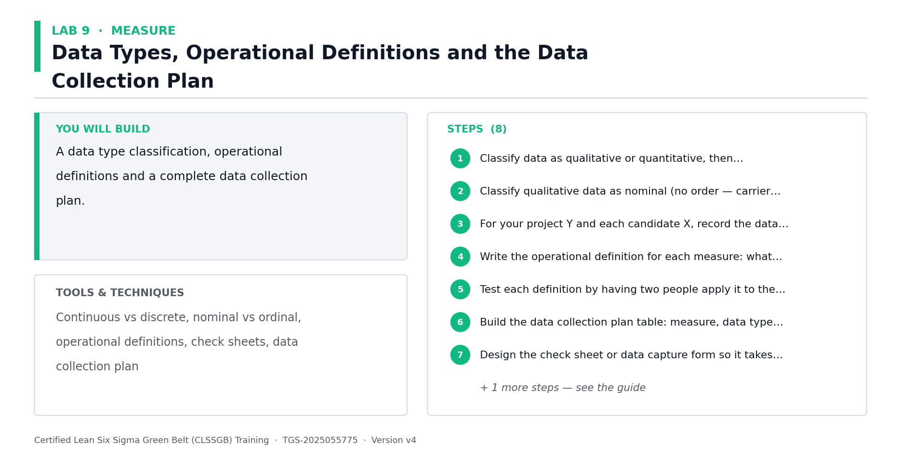

*Lab 9 at a glance — the deliverable, the tools and the steps.*

**Step-by-step**

1. Classify data as qualitative or quantitative, then quantitative as discrete (countable) or continuous (measurable on a scale).
2. Classify qualitative data as nominal (no order — carrier name, defect type) or ordinal (ordered — priority, satisfaction rating).
3. For your project Y and each candidate X, record the data type. Note where a discrete measure could be converted to continuous — always prefer continuous.
4. Write the operational definition for each measure: what exactly is counted, when the clock starts and stops, which system field, and what is excluded.
5. Test each definition by having two people apply it to the same five records — if they disagree, the definition is not yet operational.
6. Build the data collection plan table: measure, data type, operational definition, source, who collects, how often, sample size, and how it is recorded.
7. Design the check sheet or data capture form so it takes under 30 seconds to complete — complex forms do not get filled in.
8. Add a stratification plan: capture shift, product family, carrier and picker at the same time so the Analyze phase can slice the data.

**Check your work**

Two people applying your operational definitions to the same records produce identical values, and your plan captures stratification factors alongside the main measure.

> **Note:** The full worksheet for this lab is in labs/lab-09-*.md.

---


### Lab 10 — Sampling Techniques and Sample Size Calculation  [Core]

Objective: Select a sampling method and calculate the required sample size (A4).

Goal: Measuring the whole population is rarely affordable, and a biased sample invalidates every conclusion that follows. Choose the right sampling technique, then calculate how much data is actually needed using the Green Belt sample size formula rather than guessing.

**What you'll build**

A justified sampling plan and calculated sample sizes for continuous and discrete data.   (Tools and techniques: Simple random, stratified, systematic and cluster sampling, sample size formulas.)

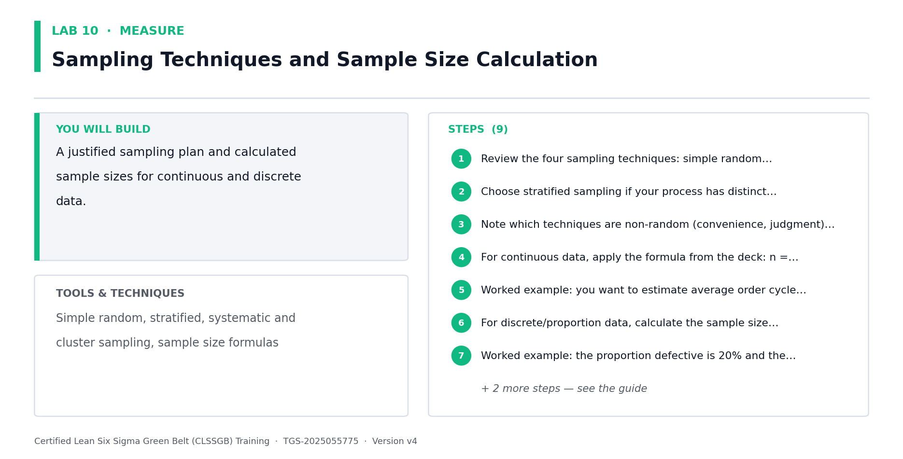

*Lab 10 at a glance — the deliverable, the tools and the steps.*

**Step-by-step**

1. Review the four sampling techniques: simple random, stratified (sample within subgroups), systematic (every Nth), and cluster.
2. Choose stratified sampling if your process has distinct subgroups — for Northwind, sample within each shift and each carrier so no group is missed.
3. Note which techniques are non-random (convenience, judgment) and why they must not be used when the data will feed statistical analysis.
4. For continuous data, apply the formula from the deck: n = (1.96s / d)^2, where s is the estimated standard deviation, d is the margin of error and 1.96 gives 95% confidence.
5. Worked example: you want to estimate average order cycle time within 5 hours (d = 5) and a preliminary estimate of the standard deviation is 10 hours (s = 10). Calculate n.

   ```bash
   n = (1.96 x 10 / 5)^2 = (3.92)^2 = 15.4, round up to 16 observations
   ```

6. For discrete/proportion data, calculate the sample size using the proportion defective and the margin of error given in the deck's formula.
7. Worked example: the proportion defective is 20% and the margin of error is 0.0784. Calculate the required sample size.
8. Compare the calculated n against what is practically collectable. If n is unaffordable, either widen the margin of error d or reduce the confidence level — and record that trade-off.
9. Write the final sampling plan: technique, sample size, sampling interval, period covered and who collects.

**Check your work**

Your sample size is calculated from the formula rather than assumed, and your sampling technique is random or stratified — never convenience.

> **Note:** The full worksheet for this lab is in labs/lab-10-*.md.

---


### Lab 11 — Measurement System Analysis and Gage R&R  [Core]

Objective: Prove the measurement system is trustworthy before trusting the data (A4).

Goal: This is a defining Green Belt skill. If the measurement system itself varies, you will chase phantom process problems. MSA separates total variation into real process variation and measurement variation, then tests repeatability (same appraiser) and reproducibility (different appraisers).

**What you'll build**

An attribute Gage R&R study with repeatability, reproducibility and accuracy percentages.   (Tools and techniques: MSA, components of variation, accuracy, repeatability, reproducibility, resolution, Gage R&R acceptance.)


*Lab 11 at a glance — the deliverable, the tools and the steps.*

**Step-by-step**

1. Draw the components of variation tree: total observed variation = actual process variation + measurement system variation.
2. Split measurement variation into its parts — repeatability (one appraiser, repeated measures) and reproducibility (between appraisers).
3. Check resolution first using the ten-bucket rule: the measurement device must resolve to about one tenth of the tolerance you need to detect.
4. Set up an attribute Gage R&R: take at least 20 sample records, label them opaquely so appraisers cannot recognise them, and record the known correct attribute for each.
5. Have two or three appraisers independently classify every sample — for Northwind, classify each order as on-time or late from the system record.
6. Repeat the exercise with the sample order randomised so appraisers cannot recall their first answer.
7. Calculate repeatability per appraiser: the percentage of samples where that appraiser agreed with themselves across both trials.
8. Calculate reproducibility: the percentage of samples where all appraisers agreed with each other.
9. Calculate accuracy: the percentage where each appraiser matched the known correct attribute.
10. Apply the acceptance criteria — a system agreeing only around 50% of the time is not fit for use. Record what must be fixed: the operational definition, training or the device.

**Check your work**

You can state your repeatability, reproducibility and accuracy percentages and give a clear go/no-go verdict on whether the measurement system can be trusted.

> **Note:** The full worksheet for this lab is in labs/lab-11-*.md.

---


### Lab 12 — Yield, DPU, DPO, DPMO, RTY and the Hidden Factory  [Core]

Objective: Calculate the full family of process performance metrics from raw data (A4).

Goal: Classic yield counts what came out good at the end and hides all the rework that got it there — the hidden factory. Rolled throughput yield multiplies the first pass yield of every step and exposes the true cost of a multi-step process.

**What you'll build**

A metrics worksheet with yield, FPY, RTY, DPU, DPO and DPMO calculated for the process.   (Tools and techniques: Classic yield, first pass yield, rolled throughput yield, DPU, DPO, DPMO, DUDO analysis.)

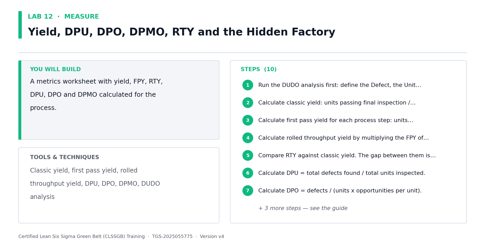

*Lab 12 at a glance — the deliverable, the tools and the steps.*

**Step-by-step**

1. Run the DUDO analysis first: define the Defect, the Unit, the Defect Opportunities per unit and the Observed defects — every metric depends on these four definitions.
2. Calculate classic yield: units passing final inspection / units started, expressed as a percentage.
3. Calculate first pass yield for each process step: units passing that step first time without rework / units entering that step.
4. Calculate rolled throughput yield by multiplying the FPY of every step together — RTY = FPY1 x FPY2 x ... x FPYn.
5. Compare RTY against classic yield. The gap between them is the hidden factory: the rework you were paying for but not measuring.
6. Calculate DPU = total defects found / total units inspected.
7. Calculate DPO = defects / (units x opportunities per unit).
8. Calculate DPMO = DPO x 1,000,000, then convert to a sigma level using the conversion table.
9. For a five-step process where each step runs at 95% FPY, calculate RTY and note how a 'good' 95% per step collapses to roughly 77% end to end.

   ```bash
   RTY = 0.95^5 = 0.7738, or 77.4%
   ```

10. Record the baseline figures — these are what the Improve phase must beat.

**Check your work**

Your RTY is lower than your classic yield, you can explain the hidden factory gap between them, and your DPMO converts to a stated sigma level.

> **Note:** The full worksheet for this lab is in labs/lab-12-*.md.

---


### Lab 13 — Descriptive Statistics, Normality and Baseline Process Capability  [Core]

Objective: Summarise the baseline statistically and calculate Cp and Cpk (A4, K1).

Goal: Close the Measure phase by describing the data — central tendency, dispersion and shape — testing whether it is normal, and converting it into capability indices. Cp asks whether the process COULD fit inside the specification; Cpk asks whether it actually does, given where it is centred.

**What you'll build**

A descriptive statistics summary, a normality assessment and calculated Cp and Cpk values.   (Tools and techniques: Mean, median, range, standard deviation, histogram, normal distribution, Cp, Cpk, sigma level.)

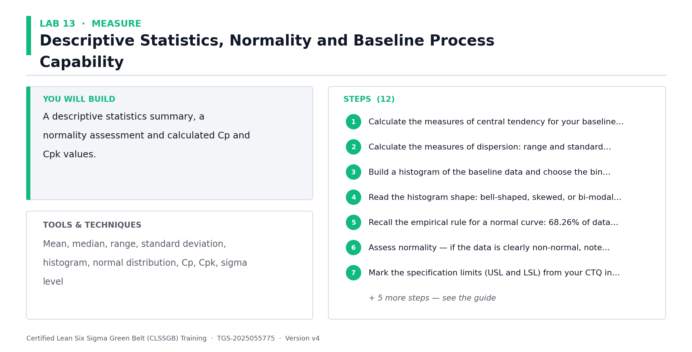

*Lab 13 at a glance — the deliverable, the tools and the steps.*

**Step-by-step**

1. Calculate the measures of central tendency for your baseline data: mean, median and mode. Note which is more resistant to outliers.
2. Calculate the measures of dispersion: range and standard deviation. Variation, not the average, is what the customer feels.
3. Build a histogram of the baseline data and choose the bin count carefully — too few bins show nothing, too many look like a comb.
4. Read the histogram shape: bell-shaped, skewed, or bi-modal. A bi-modal shape usually means you are measuring two processes as if they were one — stratify and re-plot.
5. Recall the empirical rule for a normal curve: 68.26% of data within +/-1 standard deviation, 95.46% within +/-2, and 99.73% within +/-3.
6. Assess normality — if the data is clearly non-normal, note that hypothesis tests assuming normality will not be valid in Lab 17.
7. Mark the specification limits (USL and LSL) from your CTQ in Lab 4 onto the histogram and count how many observations fall outside.
8. Calculate Cp using the formula from the deck: Cp = (USL - LSL) / 6s, that is specification width divided by process spread.
9. Worked example: USL = 48 hours, LSL = 0 hours, standard deviation s = 6 hours. Calculate Cp.

   ```bash
   Cp = (48 - 0) / (6 x 6) = 48 / 36 = 1.33
   ```

10. Calculate Cpk, which also accounts for how far off-centre the process sits, and compare against the Cp value.
11. Interpret the result: Cp >= 1 means potentially capable, Cpk >= 1.33 is the usual minimum for customer satisfaction, and many organisations target 2.0.
12. If Cp is acceptable but Cpk is poor, record the conclusion: the process spread is fine but the process is off-centre — a very different fix.

**Check your work**

You can state your baseline Cp and Cpk, explain the difference between them, and say whether the problem is spread, centring or both.

> **Note:** The full worksheet for this lab is in labs/lab-13-*.md.

---


## ANALYZE — Analyze — Find and Prove the Root Cause  (26%)

Variation · Pareto · Run charts · Fishbone · 5 Whys · Multi-voting · Hypothesis testing · p-values · Correlation · Regression

**Key concepts**

- Common vs special cause — Common cause is built into the process; special cause is an external, assignable signal.
- Pareto analysis — The 80/20 rule separates the vital few causes from the trivial many — attack the vital few.
- Run charts — Plot the metric over time to reveal trend, shift, cluster, mixture, oscillation and bias.
- Fishbone (Ishikawa) — Organise candidate causes by 5M+E — Manpower, Method, Machine, Material, Measurement, Environment.
- 5 Whys — Drill from the symptom to an actionable cause — stop when the answer is a process, not a person.
- Descriptive statistics — Central tendency (mean, median) and dispersion (range, standard deviation) describe the data.
- Hypothesis testing — State H0 and Ha, choose the right test, then let the p-value decide — not the loudest voice.
- p-value & alpha — If p < alpha, reject H0. At 95% confidence alpha = 0.05. Type I risks the producer, Type II the consumer.
- Correlation & regression — Quantify how strongly an X drives Y — and remember correlation never proves causation.


### Lab 14 — Variation, Run Charts and Stability Analysis  [Core]

Objective: Distinguish common cause from special cause variation using run charts (A3).

Goal: Before hunting root causes, establish whether the process is stable. Common cause variation is built into the process and requires a process change; special cause variation is an assignable external event. Confusing the two leads to tampering — reacting to noise and making the process worse.

**What you'll build**

A run chart of the baseline data with the six non-random patterns assessed.   (Tools and techniques: Common vs special cause, run chart, median line, trend, shift, cluster, mixture, oscillation, bias.)

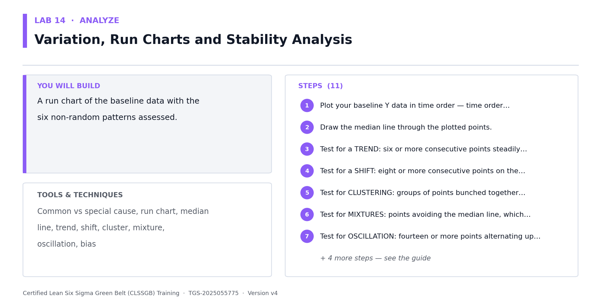

*Lab 14 at a glance — the deliverable, the tools and the steps.*

**Step-by-step**

1. Plot your baseline Y data in time order — time order matters, so never sort the data first.
2. Draw the median line through the plotted points.
3. Test for a TREND: six or more consecutive points steadily increasing or decreasing.
4. Test for a SHIFT: eight or more consecutive points on the same side of the median, indicating the process level changed.
5. Test for CLUSTERING: groups of points bunched together, suggesting a batch or intermittent effect.
6. Test for MIXTURES: points avoiding the median line, which usually means two different processes are being plotted as one.
7. Test for OSCILLATION: fourteen or more points alternating up and down, often over-adjustment by operators.
8. Test for BIAS: too few or too many runs above and below the median compared with what randomness would produce.
9. Classify your process: stable with common cause variation only, or unstable with special causes present.
10. If special causes are present, investigate and record what changed at that point in time before proceeding — an unstable process cannot be meaningfully capable.
11. Explain the tampering trap: adjusting a stable process in response to common cause variation always increases variation.

**Check your work**

You can state whether your process is stable, name every non-random pattern you tested for, and explain what tampering is and why it makes things worse.

> **Note:** The full worksheet for this lab is in labs/lab-14-*.md.

---


### Lab 15 — Pareto Analysis, Stratification and Boxplots  [Core]

Objective: Prioritise the vital few causes using Pareto and stratified analysis (A3).

Goal: The 80/20 rule states that roughly 80% of the effect comes from 20% of the causes. Build a Pareto chart to find the vital few, then stratify the data by shift, carrier and product family to test whether the problem is universal or concentrated — a concentrated problem is far easier to fix.

**What you'll build**

A Pareto chart with cumulative line, stratified Pareto charts and comparative boxplots.   (Tools and techniques: Pareto principle, Pareto chart, cumulative percentage, stratification, boxplot, quartiles, outliers.)

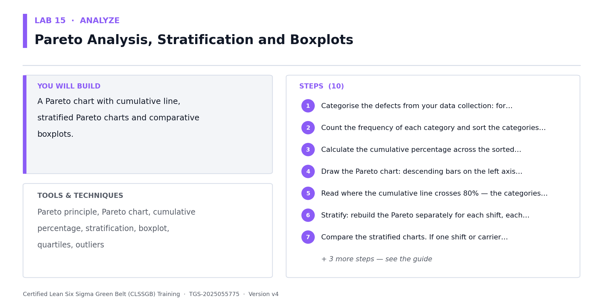

*Lab 15 at a glance — the deliverable, the tools and the steps.*

**Step-by-step**

1. Categorise the defects from your data collection: for Northwind, the reasons orders shipped late.
2. Count the frequency of each category and sort the categories in descending order of frequency.
3. Calculate the cumulative percentage across the sorted categories.
4. Draw the Pareto chart: descending bars on the left axis, cumulative percentage line on the right axis.
5. Read where the cumulative line crosses 80% — the categories to the left of that point are your vital few.
6. Stratify: rebuild the Pareto separately for each shift, each carrier and each product family.
7. Compare the stratified charts. If one shift or carrier dominates, the problem is concentrated and your project scope should narrow to it.
8. Build a boxplot of cycle time by stratification factor — read the median, the interquartile box, the whiskers and any outliers.
9. Use the boxplots to compare groups visually: if the boxes barely overlap, the groups are probably genuinely different — a hypothesis you will test formally in Lab 17.
10. Write your prioritisation conclusion: which categories you will pursue and which you are explicitly deferring.

**Check your work**

Your Pareto identifies the vital few crossing 80% cumulative, and your stratified charts show whether the problem is universal or concentrated in a subgroup.

> **Note:** The full worksheet for this lab is in labs/lab-15-*.md.

---


### Lab 16 — Fishbone, 5 Whys, Multi-Voting and Cause Prioritisation  [Core]

Objective: Generate, organise and prioritise candidate root causes (A3, K2).

Goal: Structured cause generation prevents the team jumping to a favourite theory. Use a Fishbone to organise causes by category, 5 Whys to drill from symptom to actionable cause, and multi-voting to converge on the few worth testing with data.

**What you'll build**

A Fishbone diagram, three 5 Whys chains and a multi-voted shortlist of causes to test.   (Tools and techniques: Ishikawa/Fishbone, 5M+E categories, 5 Whys, brainstorming, multi-voting, nominal group technique.)


*Lab 16 at a glance — the deliverable, the tools and the steps.*

**Step-by-step**

1. Write the effect — your project problem — in the fish head. State it as a measurable problem, not a vague complaint.
2. Draw the main bones using the 5M+E categories: Manpower, Method, Machine, Material, Measurement and Environment.
3. Brainstorm causes onto each bone. Set brainstorming ground rules first: no criticism, quantity over quality, build on others' ideas.
4. For each major bone, ask 'why does this happen?' to add sub-causes — a bone with no sub-causes has not been explored.
5. Select the three most promising causes and run a 5 Whys chain on each, asking why repeatedly until you reach an actionable process cause.
6. Stop each 5 Whys chain when the answer becomes a process or system, not a person — 'the picker was careless' is a symptom, not a root cause.
7. Check each chain for logical validity by reading it backwards with 'therefore' — if it does not read logically, the chain is broken.
8. Run multi-voting to converge: each participant gets N/3 votes to distribute across the candidate causes.
9. Rank the causes by votes and select the top three to five for statistical validation.
10. For each shortlisted cause, write the hypothesis you will test in Lab 17 and name the data you need to test it.
11. Record explicitly that a cause is only a ROOT cause once data supports it — until then it remains a theory.

**Check your work**

Every Fishbone bone has sub-causes, each 5 Whys chain ends at a process cause rather than a person, and each shortlisted cause has a testable hypothesis written for it.

> **Note:** The full worksheet for this lab is in labs/lab-16-*.md.

---


### Lab 17 — Hypothesis Testing — Test Selection, p-values and Conclusions  [Core]

Objective: Prove or disprove a suspected root cause statistically (A3, K2).

Goal: The defining Green Belt skill. Instead of asserting that the night shift is slower, state it as a hypothesis, choose the correct test for your data type and question, and let the p-value decide. This is how a Green Belt replaces opinion with evidence.

**What you'll build**

Stated hypotheses, a justified test selection, and a documented statistical conclusion.   (Tools and techniques: H0 and Ha, alpha, p-value, Type I and Type II error, t-tests, paired t, chi-square, ANOVA, Mann-Whitney.)

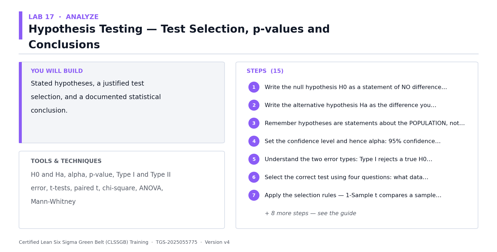

*Lab 17 at a glance — the deliverable, the tools and the steps.*

**Step-by-step**

1. Write the null hypothesis H0 as a statement of NO difference or no effect — it always contains an equals relationship.
2. Write the alternative hypothesis Ha as the difference you suspect — not equal, greater than, or less than.
3. Remember hypotheses are statements about the POPULATION, not the sample. You can simply calculate the sample mean; you infer about the population.
4. Set the confidence level and hence alpha: 95% confidence gives alpha = 0.05; 99% gives 0.01.
5. Understand the two error types: Type I rejects a true H0 (producer risk, measured by alpha); Type II accepts a false H0 (consumer risk, measured by beta).
6. Select the correct test using four questions: what data type, how many levels of X, is the data normal, and are you testing means, medians, variances or proportions.
7. Apply the selection rules — 1-Sample t compares a sample mean to a target; 2-Sample t compares means of two different populations; Paired t compares the same subjects before and after.
8. Note the classic trap: the same team measured before and after training needs a PAIRED t-test, while team A versus team B needs a 2-SAMPLE t-test.
9. For non-normal data comparing medians, use the non-parametric equivalents: One-Sample Wilcoxon or Mann-Whitney.
10. For comparing proportions use 1-Proportion or 2-Proportion; for comparing variances use the chi-square or F-test; for more than two groups use ANOVA.
11. Test your Northwind hypothesis: is the mean order cycle time on the night shift significantly greater than on the day shift? State H0, Ha and the test you selected.
12. Run the test and read the p-value. Apply the decision rule: if p < alpha, reject H0 and accept Ha; if p > alpha, fail to reject H0.
13. Worked interpretation: with alpha set at 0.05, a returned p-value of 0.031 means reject H0 — the difference is statistically significant.
14. Translate the statistical result into business language for your sponsor — never present a p-value without saying what it means for the process.
15. Record the caution: failing to reject H0 does not prove H0 is true; it means you lack sufficient evidence to reject it, which may simply mean too small a sample.

**Check your work**

For each tested cause you can state H0, Ha, the test selected with justification, the p-value, the decision against alpha, and the business conclusion in plain language.

> **Note:** The full worksheet for this lab is in labs/lab-17-*.md.

---


### Lab 18 — Correlation, Regression and Quantifying the X-Y Relationship  [Core]

Objective: Quantify how strongly each X drives Y and build a predictive model (A3).

Goal: Hypothesis testing tells you whether a difference exists; correlation and regression tell you how strongly two variables move together and let you predict Y from X. This is how a Green Belt identifies which Xs are worth controlling — while never forgetting that correlation does not prove causation.

**What you'll build**

A scatter plot, a correlation coefficient, a regression equation and a prediction with its limits.   (Tools and techniques: Scatter plot, Pearson correlation coefficient R, coefficient of determination r-squared, linear regression, prediction.)

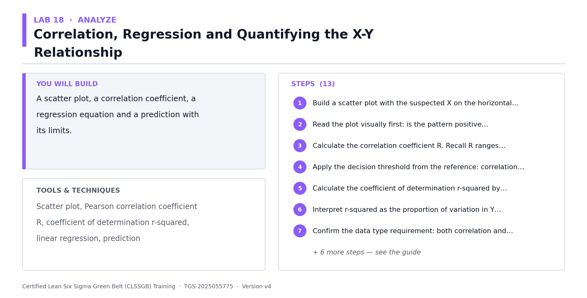

*Lab 18 at a glance — the deliverable, the tools and the steps.*

**Step-by-step**

1. Build a scatter plot with the suspected X on the horizontal axis and the project Y on the vertical axis.
2. Read the plot visually first: is the pattern positive, negative, or absent? Is it linear or curved? Are there outliers?
3. Calculate the correlation coefficient R. Recall R ranges from -1 to +1: +1 is perfect positive, -1 perfect negative, 0 no relationship.
4. Apply the decision threshold from the reference: correlation is considered to occur when R is 0.4 or greater, or -0.4 or less.
5. Calculate the coefficient of determination r-squared by squaring R.
6. Interpret r-squared as the proportion of variation in Y explained by X. If R = 0.86 then r-squared = 0.74, so about 74% of the variation in Y relates to X and 26% is unexplained.
7. Confirm the data type requirement: both correlation and regression need continuous or ratio data. Category names against outputs do not qualify — use Pareto instead.
8. Fit the regression line and record the equation in the form y = mx + c.
9. Use the equation to predict Y at two specific X values, and check the predictions against actual observed data at those points.
10. Solve the equation in reverse to find the X range that delivers your target Y — this becomes the operating window you will control in the Control phase.
11. Test the model's honesty: for a low r-squared, show a point where the prediction badly misses the actual value and explain why the model must not be used there.
12. Write the causation caution explicitly: strong correlation does not prove X causes Y. Confirm causation with process knowledge, a designed experiment, or a pilot.
13. Combine your evidence: list which Xs are now supported by BOTH a significant hypothesis test and a meaningful correlation — these are your validated vital few.

**Check your work**

You can state R, r-squared and the regression equation, use it to predict Y, and explain in one sentence why the correlation alone does not prove causation.

> **Note:** The full worksheet for this lab is in labs/lab-18-*.md.

---


## IMPROVE — Improve — Select, De-Risk and Pilot the Fix  (12%)

Solution generation · Benchmarking · Solution selection matrix · 5S · Poka-Yoke · Pull/JIT · FMEA · DOE · Piloting

**Key concepts**

- Generating solutions — Brainstorming, brainwriting, six thinking hats and anti-brainstorming — diverge before converging.
- Benchmarking — Learn from who already does it best, inside or outside your industry.
- Solution selection matrix — Score candidate solutions against weighted criteria — feasibility, cost, impact and time.
- 5S & visual workplace — Sort, Set in order, Shine, Standardise, Sustain — for physical and digital work alike.
- Poka-Yoke — Mistake proofing makes the error difficult, obvious or impossible in the first place.
- Pull, JIT & Heijunka — Let demand pull the work, level the load, and stop pushing inventory into the process.
- FMEA & RPN — Severity x Occurrence x Detection = RPN — de-risk the change before it goes live.
- Design of Experiments — Vary factors together, not one at a time, so interactions between Xs become visible.
- Piloting — Test at small scale, measure against the baseline, then decide to scale, adjust or stop.


### Lab 19 — Solution Generation, Benchmarking and Brainwriting  [Core]

Objective: Generate a wide solution set against the proven root causes (A5).

Goal: Only now — with root causes proven by data — is it legitimate to talk about solutions. Diverge deliberately before converging: structured techniques produce far better solution sets than an open discussion dominated by the loudest voice.

**What you'll build**

A solution log of at least fifteen candidate solutions mapped to proven root causes.   (Tools and techniques: Brainstorming, brainwriting, six thinking hats, anti-brainstorming, benchmarking, SCAMPER.)

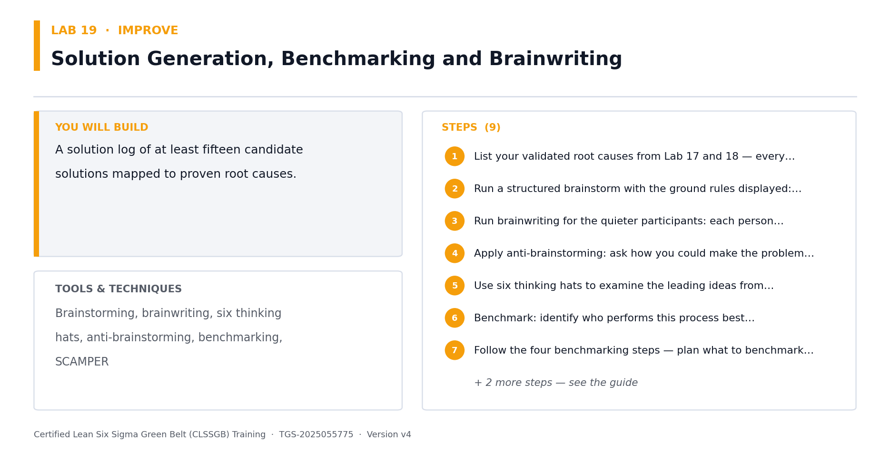

*Lab 19 at a glance — the deliverable, the tools and the steps.*

**Step-by-step**

1. List your validated root causes from Lab 17 and 18 — every solution must trace to one of them. Solutions without a cause are pet projects.
2. Run a structured brainstorm with the ground rules displayed: no criticism during generation, quantity over quality, build on others' ideas, wild ideas welcome.
3. Run brainwriting for the quieter participants: each person writes three ideas silently, then passes the sheet on for others to build upon.
4. Apply anti-brainstorming: ask how you could make the problem WORSE, then invert each answer into an improvement.
5. Use six thinking hats to examine the leading ideas from different perspectives — facts, feelings, risks, benefits, creativity and process.
6. Benchmark: identify who performs this process best, internally or in another industry, and record what they do differently.
7. Follow the four benchmarking steps — plan what to benchmark, collect the comparison data, analyse the gap, and adapt rather than copy.
8. Map every generated solution against the root cause it addresses in a two-column table, and discard any that address no proven cause.
9. Group similar solutions and remove exact duplicates, keeping at least fifteen distinct candidates.

**Check your work**

You have at least fifteen distinct solutions, every one traces to a root cause proven with data, and at least three came from benchmarking.

> **Note:** The full worksheet for this lab is in labs/lab-19-*.md.

---


### Lab 20 — Lean Countermeasures — 5S, Poka-Yoke, Pull, JIT and Standard Work  [Core]

Objective: Apply proven Lean countermeasures to the identified wastes (A5).

Goal: Lean supplies a catalogue of countermeasures with a strong track record. Rather than inventing a fix from scratch, match the waste type you found in Lab 8 to the countermeasure that reliably addresses it — and prefer poka-yoke, which prevents the error, over inspection, which merely detects it.

**What you'll build**

A countermeasure plan applying 5S, poka-yoke, pull and standard work to your process.   (Tools and techniques: 5S, poka-yoke levels, pull system, kanban, JIT, heijunka, jidoka, standard work.)

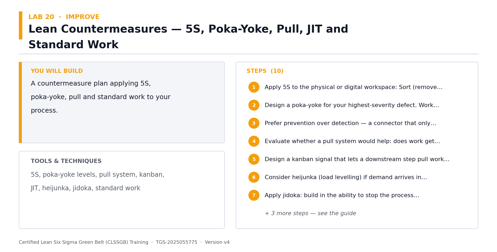

*Lab 20 at a glance — the deliverable, the tools and the steps.*

**Step-by-step**

1. Apply 5S to the physical or digital workspace: Sort (remove what is not needed), Set in order (a place for everything), Shine (clean and inspect), Standardise (make it visual), Sustain (audit it).
2. Design a poka-yoke for your highest-severity defect. Work through the three levels: prevent the error occurring, detect it as it occurs, or detect it before it passes downstream.
3. Prefer prevention over detection — a connector that only fits one way beats a checklist asking the operator to check the orientation.
4. Evaluate whether a pull system would help: does work get pushed into the process faster than it can be consumed, creating queues?
5. Design a kanban signal that lets a downstream step pull work only when it has capacity.
6. Consider heijunka (load levelling) if demand arrives in peaks — levelling the load reduces both overtime and idle time.
7. Apply jidoka: build in the ability to stop the process automatically when a defect is detected, rather than continuing to produce defects.
8. Write standard work for the improved method: the sequence, the takt time, the standard WIP and the quality checks.
9. Make the standard work visual — a photo or one-page diagram at the workstation beats a document in a shared drive.
10. Map each countermeasure back to the specific waste from your DOWNTIME analysis in Lab 8.

**Check your work**

Every countermeasure traces to a specific waste, and your poka-yoke prevents or detects the error rather than relying on someone remembering to check.

> **Note:** The full worksheet for this lab is in labs/lab-20-*.md.

---


### Lab 21 — Solution Selection Matrix and Cost-Benefit Analysis  [Core]

Objective: Select the most feasible and impactful solutions using weighted criteria (A3, A5).

Goal: This lab maps directly to Task 2 of the Practical Performance assessment. Score every candidate solution against weighted criteria so the decision is transparent and defensible — feasibility, cost, impact and time to implement — then confirm the selection with a cost-benefit analysis.

**What you'll build**

A weighted solution selection matrix with ranked results and a cost-benefit analysis.   (Tools and techniques: Solution selection matrix, weighted criteria, feasibility, cost, impact, effort-impact grid, cost-benefit analysis.)

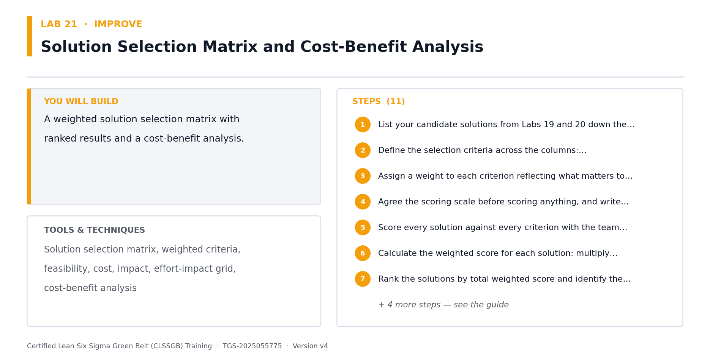

*Lab 21 at a glance — the deliverable, the tools and the steps.*

**Step-by-step**

1. List your candidate solutions from Labs 19 and 20 down the rows of the matrix.
2. Define the selection criteria across the columns: Feasibility (is it practical to implement?), Cost (is it cost-effective?), Impact (does it significantly reduce the defect?), and Time to implement (how quickly?).
3. Assign a weight to each criterion reflecting what matters to the sponsor — impact and cost usually carry the highest weights.
4. Agree the scoring scale before scoring anything, and write down what a 1 and a 5 mean for each criterion so scores are comparable.
5. Score every solution against every criterion with the team, not alone — divergent scores usually reveal a hidden assumption worth discussing.
6. Calculate the weighted score for each solution: multiply each score by its criterion weight and sum across the row.
7. Rank the solutions by total weighted score and identify the top three.
8. Cross-check the ranking on an effort-impact grid — look for the high-impact, low-effort quick wins in the top-left quadrant.
9. Run a cost-benefit analysis on the top solution: implementation cost, ongoing cost, expected annual benefit and payback period.
10. Sanity-check the selected solution against the root cause it addresses and confirm it does not simply move the problem downstream.
11. Document the rationale for the selection — a sponsor will ask why the obvious expensive option was not chosen.

**Check your work**

Your matrix has weighted criteria with a defined scoring scale, every solution is scored, and your top-ranked solution has a payback period calculated.

> **Note:** The full worksheet for this lab is in labs/lab-21-*.md.

---


### Lab 22 — FMEA, Risk Priority Numbers, DOE and Piloting  [Core]

Objective: Risk-assess and pilot the selected solution before full rollout (A5).

Goal: A solution that fails in production costs more than the problem it fixed. FMEA systematically asks how the change could fail, how bad that would be and how likely it is to be caught. Then pilot at small scale and measure against the baseline before committing.

**What you'll build**

A completed FMEA with RPN scores, a DOE plan and a pilot plan with success criteria.   (Tools and techniques: FMEA, severity, occurrence, detection, RPN, DOE factors and levels, pilot design, rollback plan.)


*Lab 22 at a glance — the deliverable, the tools and the steps.*

**Step-by-step**

1. List every process step of the NEW improved process in the FMEA worksheet.
2. For each step, identify the potential failure modes — the ways this step could go wrong.
3. For each failure mode, record the potential effect on the customer and the potential cause.
4. Score Severity 1-10: how serious is the effect on the customer if this failure occurs?
5. Score Occurrence 1-10: how likely is this cause to happen?
6. Score Detection 1-10, remembering the scale is inverted — 1 means it is almost certainly caught, 10 means it escapes undetected.
7. Calculate the Risk Priority Number: RPN = Severity x Occurrence x Detection.
8. Sort by RPN descending and address the highest scores first. Treat any Severity of 9 or 10 as requiring action regardless of its RPN.
9. Write the recommended action for each high-RPN row, assign an owner and a date, then recalculate the projected RPN after the action.
10. Plan a designed experiment for the settings you must optimise: list the factors, choose two levels (high and low) for each, and note that a 2^k design tests all combinations.
11. Record why DOE beats one-factor-at-a-time testing: OFAT cannot reveal the INTERACTION between two factors, only their individual effects.
12. Design the pilot: define the scope (one shift, one product family), the duration, the success criteria and the measurement method.
13. Set the pilot success criteria against your measured baseline from Lab 12 and 13 — the pilot must beat the baseline by a stated margin.
14. Write the rollback plan: what triggers stopping the pilot and how the process reverts safely.
15. Run the pilot, collect data using the same operational definitions as your baseline, and compare like with like.
16. Decide: scale up, adjust and re-pilot, or stop. Record the decision and the evidence behind it.

**Check your work**

Every FMEA row has an RPN, the highest RPNs have owned actions with dates, and your pilot has quantified success criteria measured against the Lab 13 baseline.

> **Note:** The full worksheet for this lab is in labs/lab-22-*.md.

---


## CONTROL — Control — Hold the Gain  (10%)

SPC · Control chart selection · Control limits · Out-of-control rules · Cp/Cpk · Control plan · SOP · Visual management · Handover

**Key concepts**

- Statistical Process Control — Monitor the process with data over time so drift is caught before it becomes a defect.
- Control chart anatomy — Centre line plus upper and lower control limits at +/- 3 standard deviations.
- Control chart selection — Continuous or attribute? Subgroup size? That decides Xbar-R, Xbar-S, I-MR, p, np, c or u.
- Out-of-control rules — A point beyond 3 sigma, runs, trends and hugging patterns each signal a special cause.
- Control limits vs spec limits — Control limits come from the process voice; specification limits come from the customer.
- Cp and Cpk — Cp = spec width / process spread. Cpk also accounts for centring — aim for Cpk >= 1.33.
- Control plan — Metric, target, measurement method, frequency, owner and the reaction plan when it drifts.
- Standard work & SOP — Lock the improved method into written, trainable, auditable standard work.
- Handover & closure — Transfer ownership to the process owner, verify the benefit, then formally close the project.


### Lab 23 — Statistical Process Control — Chart Selection and Control Limits  [Core]

Objective: Select, build and interpret the correct control chart for the process (A4, A5).

Goal: A control chart is how a process tells you it has drifted before it produces a defect. Choosing the WRONG chart for the data type invalidates every signal it gives, so selection comes first — then the limits, then the rules for reading it.

**What you'll build**

A correctly selected control chart with calculated limits and the eight rules applied.   (Tools and techniques: SPC, control chart selection tree, Xbar-R, Xbar-S, I-MR, p, np, c, u charts, control limits, zones.)

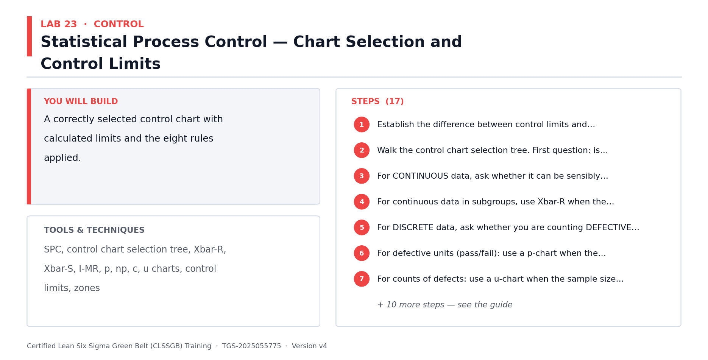

*Lab 23 at a glance — the deliverable, the tools and the steps.*

**Step-by-step**

1. Establish the difference between control limits and specification limits: control limits come from the process itself (the voice of the process), specification limits come from the customer (the voice of the customer). Never plot spec limits on a control chart.
2. Walk the control chart selection tree. First question: is your data continuous (variable) or discrete (attribute)?
3. For CONTINUOUS data, ask whether it can be sensibly subgrouped. If not, use an Individuals and Moving Range (I-MR) chart.
4. For continuous data in subgroups, use Xbar-R when the subgroup size is under 8, and Xbar-S when the subgroup size is 8 or more.
5. For DISCRETE data, ask whether you are counting DEFECTIVE UNITS or DEFECTS. This distinction decides the next branch.
6. For defective units (pass/fail): use a p-chart when the sample size varies, and an np-chart when the sample size is constant.
7. For counts of defects: use a u-chart when the sample size varies, and a c-chart when the sample size is constant.
8. Select the correct chart for your Northwind data and write down the justification against the tree.
9. Build the chart: plot the points in time order, calculate and draw the centre line, then the upper and lower control limits at +/- 3 standard deviations.
10. Divide the chart into zones: zone C within 1 sigma of the centre line, zone B between 1 and 2 sigma, zone A between 2 and 3 sigma.
11. Apply out-of-control rule 1: any single point beyond the UCL or LCL. Investigate immediately — the probability of this happening by chance is roughly 3 in 1,000.
12. Apply rule 2: nine consecutive points on the same side of the centre line, indicating the process level has shifted.
13. Apply rule 3: six consecutive points steadily increasing or decreasing, indicating a trend.
14. Apply rule 4: fourteen consecutive points alternating up and down, often caused by over-adjustment.
15. Apply rules 5 and 6: two of three consecutive points in zone A, or four of five in zone B or beyond, indicating a sudden shift.
16. Apply rules 7 and 8: fifteen consecutive points inside zone C (limits may need recalculating), or eight consecutive points with none in zone C (you may be charting two different processes).
17. Record every signal your chart shows and the assignable cause you found for each.

**Check your work**

You can justify your chart choice against the selection tree, your limits are calculated at +/- 3 sigma, and you have applied all eight out-of-control rules.

> **Note:** The full worksheet for this lab is in labs/lab-23-*.md.

---


### Lab 24 — Control Plan, SOP, Visual Management and Response Plan  [Core]

Objective: Build the control plan that sustains the improvement (A4, A5).

Goal: This lab maps directly to Task 3 of the Practical Performance assessment. The control plan is the document that keeps the gain after the project team disbands. Without a named owner and a defined reaction plan, processes drift back to their old performance within months.

**What you'll build**

A complete control plan, an SOP for the improved method and a visual management board design.   (Tools and techniques: Control plan, control limits, monitoring frequency, reaction plan, SOP, visual management, team huddles, gemba.)


*Lab 24 at a glance — the deliverable, the tools and the steps.*

**Step-by-step**

1. Build the control plan table with one row per control point and these columns: process step, CTQ metric, specification, measurement method, sample size, frequency, owner and reaction plan.
2. Select the key process metrics to track. For Northwind: order processing time, number of late orders, picking time and shipping errors.
3. Define the data collection method for each metric: who collects it, how often, and where it is recorded.
4. Set the control limits — the acceptable performance thresholds that trigger a response.
5. Write the corrective action for each metric: exactly what happens when performance breaches the control limit, and who decides.
6. Assign roles and responsibilities: name the individual accountable for each control point, not a department.
7. Write the SOP for the improved method: purpose, scope, step-by-step instructions, quality checks and escalation path.
8. Make the SOP visual and short. A one-page illustrated work instruction at the point of use beats a twenty-page document nobody opens.
9. Design the visual management board: which metrics are displayed, updated how often, by whom, and visible to whom.
10. Set up the daily team huddle: a short stand-up at the board reviewing yesterday's performance and today's risks.
11. Plan the gemba walk cadence — leadership going to where the work happens to see the process, not the report.
12. Build the training plan so every person performing the process is trained on the new standard, with a record of who was trained and when.
13. Add an audit schedule to verify the control plan is actually being followed — controls that are not audited quietly stop happening.

**Check your work**

Every control point has a named owner, a monitoring frequency and a specific reaction plan stating what to do when the metric breaches its limit.

> **Note:** The full worksheet for this lab is in labs/lab-24-*.md.

---


### Lab 25 — Verify the Gain, A3 Storyboard, Handover and Project Closure  [Core]

Objective: Prove the improvement is real and hand the process over (A5, K1).

Goal: Close the project properly: re-measure capability, prove statistically that the improvement is real rather than random, quantify the financial benefit with Finance, tell the story on a single A3 page, and formally transfer ownership to the process owner.

**What you'll build**

A before/after capability comparison, a validated benefit, an A3 storyboard and a signed handover.   (Tools and techniques: Re-measured Cp/Cpk, hypothesis test of improvement, benefit validation, A3 report, handover, lessons learned.)

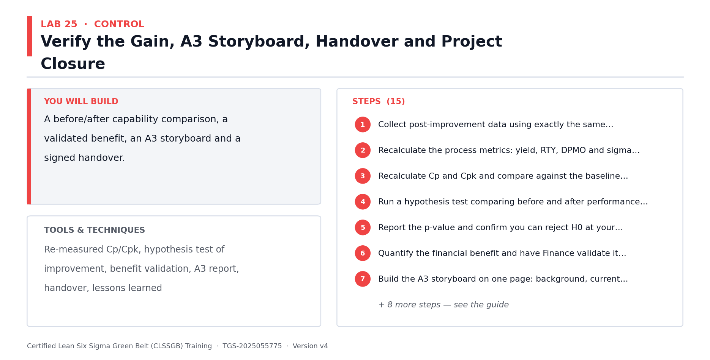

*Lab 25 at a glance — the deliverable, the tools and the steps.*

**Step-by-step**

1. Collect post-improvement data using exactly the same operational definitions and sampling method as your baseline — otherwise the comparison is meaningless.
2. Recalculate the process metrics: yield, RTY, DPMO and sigma level, using the same DUDO definitions from Lab 12.
3. Recalculate Cp and Cpk and compare against the baseline values from Lab 13.
4. Run a hypothesis test comparing before and after performance — state H0 as 'no difference' and prove the improvement is statistically significant, not random variation.
5. Report the p-value and confirm you can reject H0 at your chosen alpha. An improvement you cannot prove statistically is not yet an improvement.
6. Quantify the financial benefit and have Finance validate it — a benefit the finance team has not signed off will not be recognised by the business.
7. Build the A3 storyboard on one page: background, current state, goal, root cause analysis, countermeasures, results, and follow-up actions.
8. Include the before and after charts on the A3 — the visual comparison communicates faster than any table of numbers.
9. Present the results tailored to the audience: leadership wants the benefit and how it is controlled; the process team wants the workflow detail.
10. Follow the presentation rules: ask a question as the slide title, show one clear graphic that answers it, and state the conclusion in plain business language.
11. Hand over formally: walk the process owner through the control plan, the SOP, the charts and the reaction plan, then obtain their signature.
12. Agree the post-project review date — typically 30, 60 and 90 days — to confirm the gain has held.
13. Capture lessons learned: what worked, what did not, and what you would do differently on the next project.
14. Identify replication opportunities: where else in the business does this same problem exist, and could this solution be copied across?
15. Close the project formally with the sponsor and release the team.

**Check your work**

Your after-capability beats the baseline, the improvement is proven with a hypothesis test and a stated p-value, and the process owner has signed the handover.

> **Note:** The full worksheet for this lab is in labs/lab-25-*.md.

---


## Quick Reference — Formulas You Should Know

**Process performance metrics**

- Yield = (Good units / Total units) x 100
- DPU (Defects Per Unit) = Defects / Units
- DPO (Defects Per Opportunity) = Defects / (Units x Opportunities per unit)
- DPMO (Defects Per Million Opportunities) = DPO x 1,000,000
- First Pass Yield (FPY) = units passing with no rework / total units started
- Rolled Throughput Yield (RTY) = FPY(step 1) x FPY(step 2) x ... x FPY(step n)
- Process Cycle Efficiency = Value-added time / Total lead time
- Takt time = Available working time / Customer demand

**Sigma level reference**

- 1 sigma — 690,000 DPMO (about 31% yield)
- 2 sigma — 308,000 DPMO (about 69% yield)
- 3 sigma — 66,800 DPMO (about 93.3% yield)
- 4 sigma — 6,210 DPMO (about 99.38% yield)
- 5 sigma — 233 DPMO (about 99.977% yield)
- 6 sigma — 3.4 DPMO (about 99.99966% yield)


## Quick Reference — The Eight Wastes (DOWNTIME)

- D — Defects: output that fails the requirement and must be corrected or redone.
- O — Overproduction: producing more, or earlier, than the customer needs.
- W — Waiting: work or people idle, waiting for the next step, an approval or information.
- N — Non-utilised talent: skills and ideas of people not being used.
- T — Transport: unnecessary movement of materials, work items or information between places.
- I — Inventory: work in progress, backlogs and queues sitting between steps.
- M — Motion: unnecessary movement of people, or switching between systems and screens.
- E — Extra-processing: doing more work to the output than the customer requires or values.


## Preparing for the Assessment

- Written Assessment (WA) — Short-Answer Questions (SAQ), 2 questions (K1, K2), 60 minutes, open book.
- Practical Performance (PP) — 3 applied DMAIC tasks (A1-A5), 90 minutes, open book.
- Both papers are open book — you may use these slides, this Learner Guide and your lab outputs.
- Revise by re-reading your own lab outputs; they follow exactly the same scenario as the Case Study.
- Be ready to define Lean, Six Sigma and Lean Six Sigma, and explain how they differ.
- Be ready to name the eight wastes and give a service-industry example of each.
- Be ready to explain each DMAIC phase, what it delivers and which tools belong to it.
- Be ready to calculate yield, DPU, DPO and DPMO from raw data and read off the sigma level.
- Be ready to explain how the Fishbone diagram and 5 Whys are used together to find a root cause.
- Re-work the labs from memory — being able to produce the tools unaided is the best preparation.
- A minimum of 75% attendance is required to be eligible for assessment and funding.


## Glossary

- **Lean** — A method to maximise customer value by systematically identifying and removing waste.
- **Six Sigma** — A data-driven method to reduce variation and defects; the target is 3.4 defects per million opportunities.
- **Lean Six Sigma** — The combined method — Lean improves speed and flow, Six Sigma improves consistency and accuracy.
- **DMAIC** — Define, Measure, Analyze, Improve, Control — the Six Sigma improvement roadmap.
- **PDCA** — Plan, Do, Check, Act — a lighter improvement cycle used for small, fast improvements.
- **VOC** — Voice of the Customer — customer needs and expectations expressed in the customer's own words.
- **CTQ** — Critical to Quality — a specific, measurable requirement translated from a VOC statement.
- **SIPOC** — Suppliers, Inputs, Process, Outputs, Customers — the macro 'as-is' process map.
- **Muda** — The Japanese term for waste — any activity that consumes resource but creates no customer value.
- **DOWNTIME** — Mnemonic for the eight wastes: Defects, Overproduction, Waiting, Non-utilised talent, Transport, Inventory, Motion, Extra-processing.
- **Value-added (VA)** — An activity the customer would be willing to pay for because it changes the product or service.
- **Non-value-added (NVA)** — An activity that consumes resource but adds nothing the customer values — pure waste.
- **Defect** — An output that fails to meet the CTQ requirement.
- **Common cause variation** — Natural, always-present variation built into the process; addressed by changing the process.
- **Special cause variation** — Unusual variation traceable to a specific assignable event; addressed by investigating that event.
- **Pareto principle** — The 80/20 rule — roughly 80% of effects come from 20% of causes.
- **Run chart** — A plot of a metric over time, used to spot trend, shift, cluster and oscillation patterns.
- **5 Whys** — Repeatedly asking 'why' to drill from a symptom down to an actionable root cause.
- **Fishbone (Ishikawa) diagram** — A cause-and-effect diagram organising candidate causes into categories such as the 5Ms.
- **5M categories** — Manpower, Method, Machine, Material, Measurement — standard Fishbone categories.
- **Multi-voting** — A team technique to narrow a long list of candidate causes to an agreed shortlist.
- **DPU / DPO / DPMO** — Defects per unit / per opportunity / per million opportunities — standard defect-rate metrics.
- **Yield** — The percentage of output produced without defects.
- **RTY** — Rolled Throughput Yield — the probability a unit passes through every process step with no rework.
- **Sigma level** — A common yardstick for process performance, derived from DPMO.
- **COPQ** — Cost of Poor Quality — the internal failure, external failure, appraisal and prevention costs of defects.
- **5S** — Sort, Set in order, Shine, Standardise, Sustain — a Lean method for organising the workplace.
- **Poka-Yoke** — Mistake proofing — designing the process so an error is difficult or impossible to make.
- **Standard work** — The documented current best-known method for performing a task.
- **Kaizen** — Continuous improvement through many small changes, made by everyone.
- **Takt time** — Available working time divided by customer demand — the pace the process must run to meet demand.
- **Control plan** — The document naming the metric, target, monitoring method, frequency, owner and reaction plan.
- **Specification limits (LSL/USL)** — The acceptable limits set by the customer; outside them is a defect.
- **Control limits (LCL/UCL)** — Limits calculated from the process itself, typically the mean plus/minus three standard deviations.
- **SPC** — Statistical Process Control — monitoring a process over time to predict and prevent problems.
- **A3** — A one-page report telling the whole improvement story from background through to follow-up.
- **Gemba** — 'The real place' — going to where the work actually happens to observe the process directly.
