# Learner Guide - Certified Lean Six Sigma Green Belt (CLSSGB) Training

**Course Code:** TGS-2025055775  
**Version:** 1.0  
**Provider:** Tertiary Infotech Academy Pte Ltd

## Course Overview

This Learner Guide mirrors the CLSSGB labs in sequence. Learners use one realistic workplace process scenario across all labs and build a complete Green Belt project file, ending with an A3 project story and control plan.

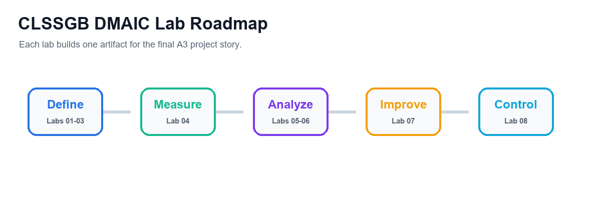

## Learning Outcomes
- Explain Lean, Six Sigma, DMAIC, COPQ, Kano and Green Belt responsibilities.
- Scope an improvement project using SIPOC and current-state process maps.
- Facilitate improvement work using stakeholders, Kaizen planning and A3 reporting.
- Define KPIs, collect data, create run/Pareto charts and interpret basic statistics.
- Use root cause analysis and FMEA to prioritize risks.
- Select countermeasures and sustain improvement through standard work and control plans.

## Lab Sequence

- Lab 01 - Lean Six Sigma Basics and Project Selection
- Lab 02 - SIPOC, Process Map, and Eight Wastes
- Lab 03 - Facilitation, Stakeholders, Kaizen, and A3
- Lab 04 - Data Collection, KPIs, Run Charts, and Pareto
- Lab 05 - Basic Statistics and Process Capability
- Lab 06 - Root Cause Analysis and FMEA
- Lab 07 - Countermeasures, 5S, Kanban, and Poka-Yoke
- Lab 08 - Control Plan, Standard Work, and Project Close

## Lab 01 - Lean Six Sigma Basics and Project Selection

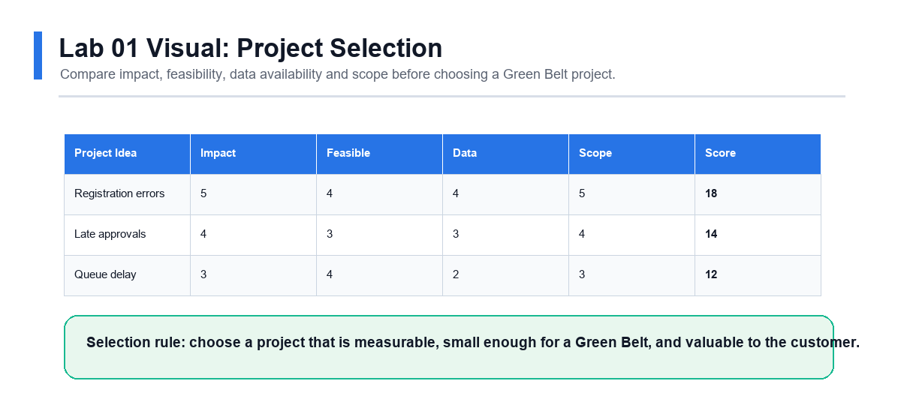

### Scenario
You have been asked to support an improvement initiative. Before mapping or measuring the process, you must choose a project that is valuable, realistic, and appropriate for a Green Belt.

### Objectives

- Explain Lean Six Sigma fundamentals.
- Describe the Green Belt role.
- Identify customer value and COPQ.
- Select a suitable improvement project.

### Steps

1. Write your own definition of Lean.
2. Write your own definition of Six Sigma.
3. List the five DMAIC phases and one activity in each phase.
4. Describe what a Green Belt typically does in an improvement project.
5. Select three possible process problems from your workplace or a trainer scenario.
6. For each problem, identify the customer affected.
7. Estimate cost of poor quality, including rework, delay, errors, complaints, or morale impact.
8. Use the Kano model to classify customer needs as basic, performance, or delight factors.
9. Write Y=f(x) for each project idea.
10. Score each project by impact, feasibility, data availability, and scope.
11. Select the best project for the remaining labs.
12. Draft a problem statement and goal statement.

### Validation

- The selected project is small enough for a Green Belt.
- The problem statement uses observable facts.
- The goal statement is measurable.
- Customer value is clearly described.

### Deliverables

- Project selection worksheet.
- COPQ notes.
- Kano notes.
- Draft problem and goal statements.

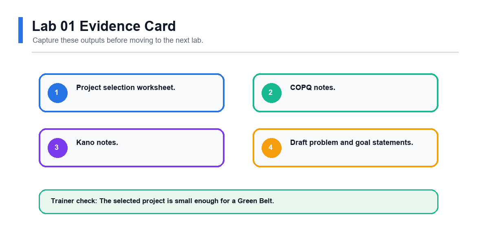

### Review Questions

1. How do Lean and Six Sigma complement each other?
2. What makes a project suitable for a Green Belt?
3. Why should COPQ include hidden costs?
4. What does Y=f(x) mean in process improvement?

## Lab 02 - SIPOC, Process Map, and Eight Wastes

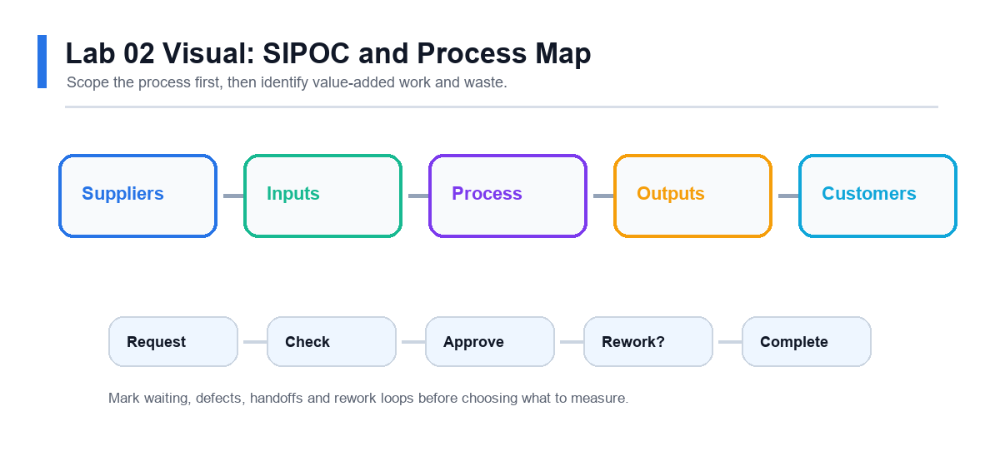

### Scenario
The selected project needs a shared view of the process. You will map the process and identify where waste may be harming customer value.

### Objectives

- Build a SIPOC.
- Create a current-state process map.
- Identify value-added and non-value-added steps.
- Locate the eight wastes.

### Steps

1. Define the start and end points of the process.
2. List the major outputs and customers.
3. List the key inputs and suppliers.
4. Create a SIPOC table.
5. Draw a current-state process map.
6. Include decision points, approvals, handoffs, queues, and rework loops.
7. Label each process step as value-added, business-value-added, or non-value-added.
8. Identify the eight wastes:
9. Mark the two most visible waste areas on the map.
10. Decide where data should be collected in Lab 04.

### Validation

- SIPOC boundaries match the project.
- Process map shows the real current state.
- Waste examples are tied to actual process steps.
- Measurement points are identified.

### Deliverables

- SIPOC.
- Current-state process map.
- Waste analysis table.
- Measurement point notes.

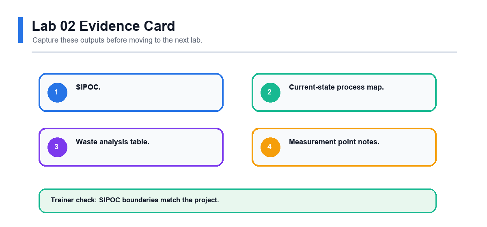

### Review Questions

1. Why should mapping show the current state instead of the ideal state?
2. Which wastes are common in office or service processes?
3. How can handoffs create delay?
4. Why is underused talent considered waste?

## Lab 03 - Facilitation, Stakeholders, Kaizen, and A3

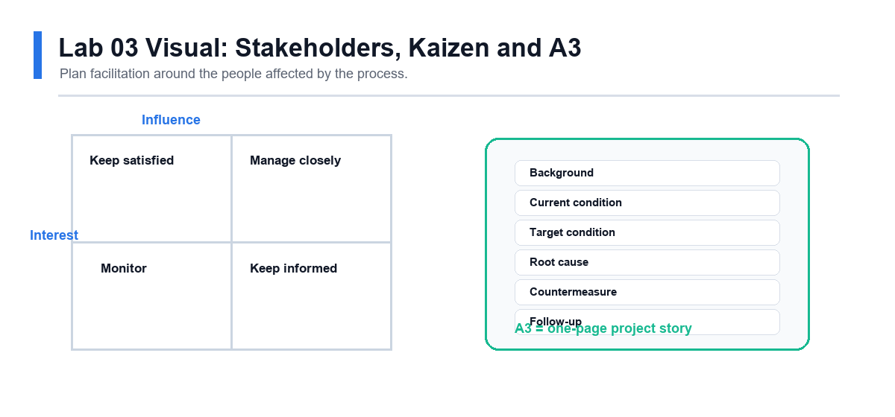

### Scenario
Green Belts often improve processes by working through people. You need to bring the right people together, keep discussion structured, and document the improvement story clearly.

### Objectives

- Identify stakeholders.
- Plan a facilitated improvement meeting.
- Design a Kaizen event.
- Start an A3 report.

### Steps

1. List all stakeholders affected by the process problem.
2. Rate each stakeholder by interest and influence.
3. Identify likely supporters, blockers, and subject matter experts.
4. Write one engagement action for each key stakeholder.
5. Create an agenda for a 60-minute improvement meeting.
6. Include objective, ground rules, roles, timing, and expected outputs.
7. Plan a Kaizen event for one process pain point.
8. Define pre-work, event activities, and follow-up actions.
9. Create an A3 report with background, current condition, goal, and next step sections.
10. Practise explaining the A3 in three minutes.
11. Update the A3 based on peer or trainer feedback.

### Validation

- Stakeholder actions match stakeholder concerns.
- Meeting agenda has clear outputs.
- Kaizen scope is small and practical.
- A3 report tells the project story simply.

### Deliverables

- Stakeholder analysis.
- Facilitation agenda.
- Kaizen plan.
- Draft A3 report.

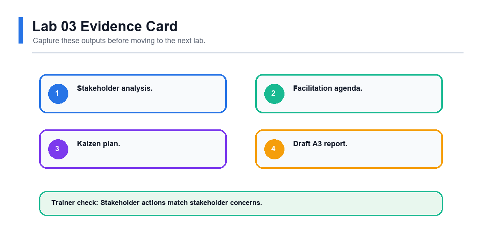

### Review Questions

1. Why is facilitation important for Green Belts?
2. What makes a Kaizen event focused?
3. How does an A3 report support communication?
4. Why should blockers be engaged early?

## Lab 04 - Data Collection, KPIs, Run Charts, and Pareto

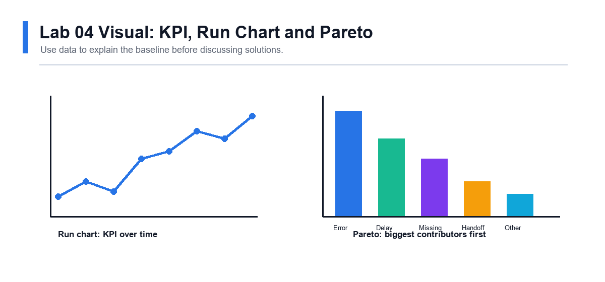

### Scenario
The project team needs baseline data. You will define what to measure, collect or use sample data, and visualize the problem.

### Objectives

- Define a KPI.
- Create a data collection plan.
- Build a run chart.
- Build a Pareto chart.

### Steps

1. Select one primary KPI for the project.
2. Write an operational definition for the KPI.
3. Define unit, defect, opportunity, and target if applicable.
4. Identify data source, owner, frequency, and sample size.
5. Create a data collection plan.
6. Collect baseline data or use a trainer-provided dataset.
7. Check for missing values, duplicate records, and inconsistent categories.
8. Create a run chart showing performance over time.
9. Add notes for known events or process changes.
10. Create a Pareto chart for defect categories, delay reasons, or error types.
11. Identify the top category contributing to the problem.
12. Decide what issue should move into root cause analysis.

### Validation

- KPI definition is clear enough for two people to measure consistently.
- Run chart uses time order.
- Pareto chart is sorted from largest to smallest.
- Analysis identifies where to focus next.

### Deliverables

- KPI definition.
- Data collection plan.
- Run chart.
- Pareto chart.
- Focus area statement.

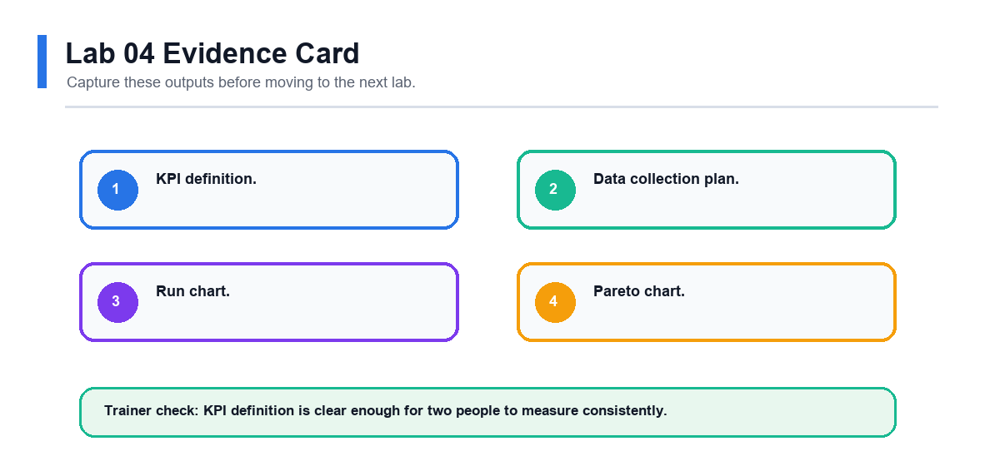

### Review Questions

1. Why do operational definitions matter?
2. What does a run chart show that a simple average hides?
3. Why is Pareto analysis useful?
4. What data quality checks should be done before analysis?

## Lab 05 - Basic Statistics and Process Capability

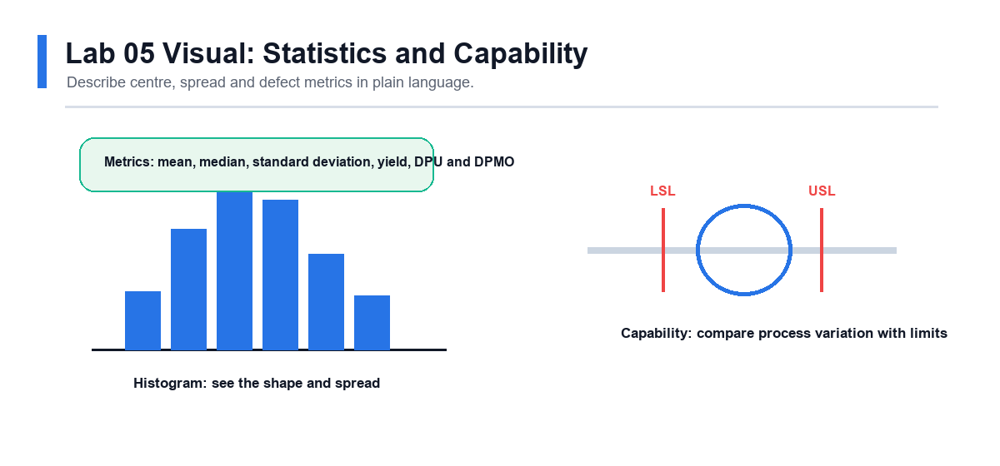

### Scenario
After visualizing the data, you need to summarize baseline performance. The goal is to describe both the center and spread of the process.

### Objectives

- Calculate basic statistics.
- Interpret variation.
- Calculate common Six Sigma metrics.
- Summarize baseline performance.

### Steps

1. Open the baseline dataset from Lab 04.
2. Calculate count, mean, median, minimum, maximum, range, and standard deviation.
3. Create a histogram for continuous data if applicable.
4. Identify whether the process has obvious outliers.
5. Calculate yield if good units and total units are known.
6. Calculate DPU if defects and units are known.
7. Calculate DPMO if opportunities are known.
8. Estimate sigma level using a trainer-provided conversion table if available.
9. Compare actual performance with customer or business target.
10. Write a short baseline summary using numbers and plain language.
11. Identify one question that still needs investigation.

### Validation

- Statistics are calculated from the correct dataset.
- Variation is discussed, not only the average.
- Defect metrics use correct denominators.
- Baseline summary is clear to a non-statistical reader.

### Deliverables

- Basic statistics table.
- Histogram if applicable.
- Yield, DPU, DPMO, or sigma worksheet.
- Baseline performance summary.

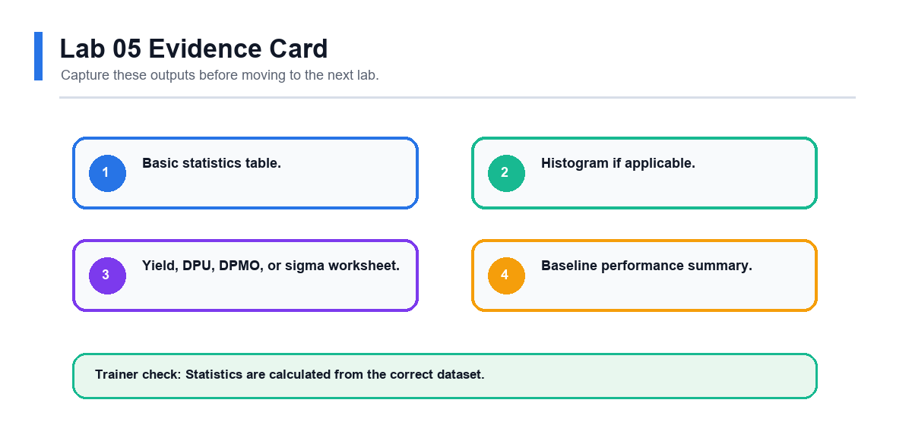

### Review Questions

1. Why can averages be misleading?
2. What is the difference between defects and defective units?
3. Why does DPMO include opportunities?
4. How can variation affect customer experience?

## Lab 06 - Root Cause Analysis and FMEA

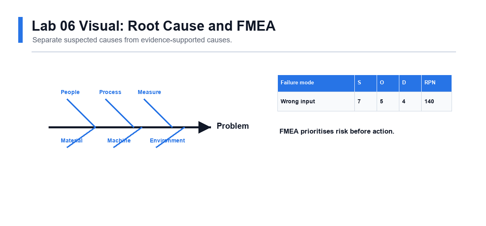

### Scenario
The team now understands the baseline problem. You will identify possible causes and use FMEA to decide where countermeasures are most needed.

### Objectives

- Use Fishbone and 5 Whys.
- Validate suspected causes with evidence.
- Build an FMEA.
- Prioritize process risks.

### Steps

1. Select the biggest issue from Lab 04 or Lab 05.
2. Create a fishbone diagram.
3. Use categories such as people, process, material, equipment, measurement, environment, and management.
4. Choose two likely causes from the fishbone.
5. Complete 5 Whys for each selected cause.
6. Identify what evidence would support or reject each cause.
7. Review available data or collect quick observations.
8. Mark each cause as supported, unsupported, or needing more data.
9. Create an FMEA for the process step most related to the problem.
10. List failure mode, effect, cause, and current controls.
11. Score severity, occurrence, and detection.
12. Calculate RPN.
13. Identify the top risks for countermeasures.

### Validation

- Root causes are not based only on opinion.
- 5 Whys reaches process-level causes.
- FMEA scores are discussed by the team.
- High-priority risks are clear.

### Deliverables

- Fishbone diagram.
- 5 Whys worksheet.
- Evidence notes.
- FMEA.
- Prioritized root cause and risk list.

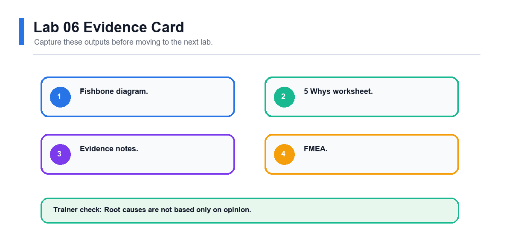

### Review Questions

1. Why can 5 Whys fail if the team stops too early?
2. What is the purpose of FMEA?
3. Why should FMEA include current controls?
4. How does RPN help prioritize action?

## Lab 07 - Countermeasures, 5S, Kanban, and Poka-Yoke

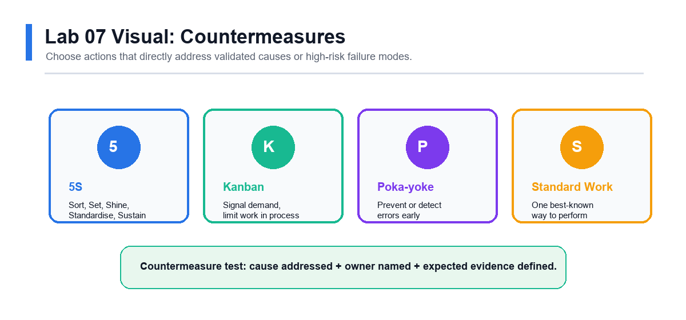

### Scenario
The team is ready to improve the process. The countermeasures must address validated causes and be simple enough to test quickly.

### Objectives

- Select countermeasures linked to root causes.
- Apply 5S and visual management.
- Use Kanban concepts.
- Design mistake proofing.

### Steps

1. List supported root causes and high-priority FMEA risks.
2. Brainstorm possible countermeasures.
3. Remove ideas that do not address a validated cause.
4. Use an impact-effort matrix to prioritize options.
5. Select one or two countermeasures for a small test.
6. Apply 5S to the relevant physical or information workspace.
7. Identify where visual management would help the team see status or errors.
8. Identify where a Kanban signal could prevent waiting, shortage, or overload.
9. Design one poka-yoke idea to prevent or detect an error earlier.
10. Draft standard work for the improved step.
11. Define test duration, success measure, and rollback condition.
12. Record expected benefits and possible side effects.

### Validation

- Each countermeasure links to a supported cause or risk.
- Impact-effort matrix supports the selection.
- Standard work is clear enough for another person to follow.
- Test criteria are measurable.

### Deliverables

- Countermeasure list.
- Impact-effort matrix.
- 5S action list.
- Kanban or visual control sketch.
- Poka-yoke idea.
- Draft standard work.

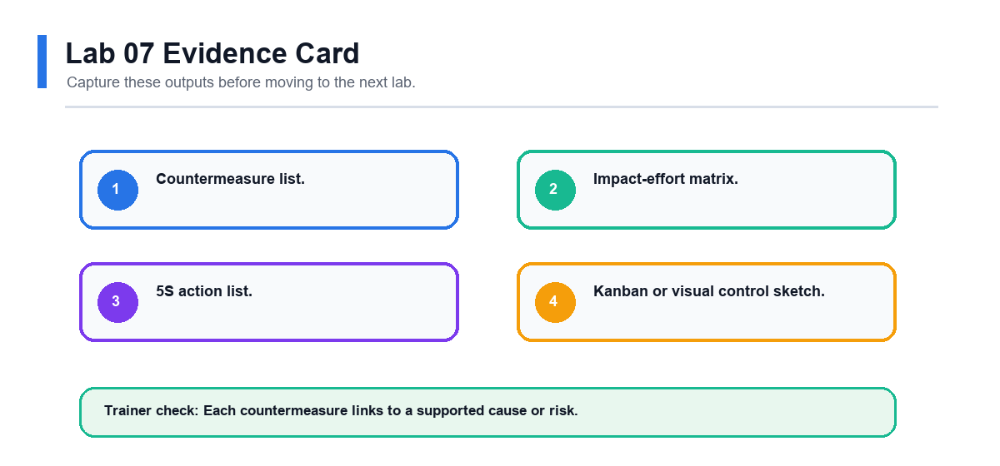

### Review Questions

1. Why should countermeasures be linked to root causes?
2. How does 5S improve process stability?
3. What is the purpose of Kanban?
4. Why is mistake proofing better than end-of-process inspection?

## Lab 08 - Control Plan, Standard Work, and Project Close

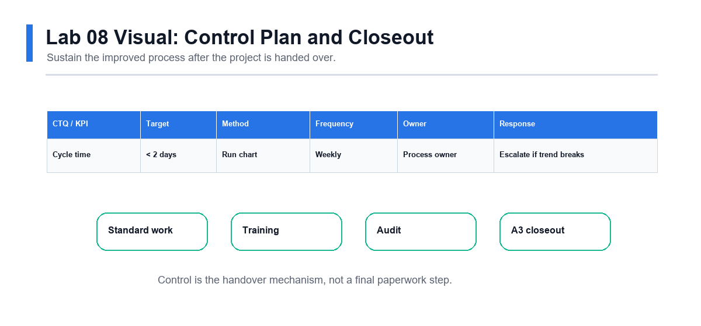

### Scenario
The improvement has been selected and tested. You must make sure the process owner can sustain the result after the project closes.

### Objectives

- Build a control plan.
- Define response actions.
- Finalize standard work.
- Present the project using A3.

### Steps

1. List the improved process steps that require control.
2. Identify the KPI or CTQ to monitor.
3. Define target, measurement method, frequency, and owner.
4. Write a response plan for performance outside the expected range.
5. Finalize standard work instructions.
6. Define training actions for team members.
7. Define audit or check-in frequency.
8. Compare before and after performance if pilot data is available.
9. Update the A3 report with root cause, countermeasure, result, and follow-up.
10. Prepare a five-minute presentation.
11. Present the project story to a peer or trainer.
12. Record lessons learned and remaining risks.

### Validation

- Control plan has clear owner and frequency.
- Response plan says what to do when performance changes.
- A3 report tells the complete improvement story.
- Handover actions are practical.

### Deliverables

- Control plan.
- Response plan.
- Final standard work.
- Final A3 report.
- Project presentation notes.

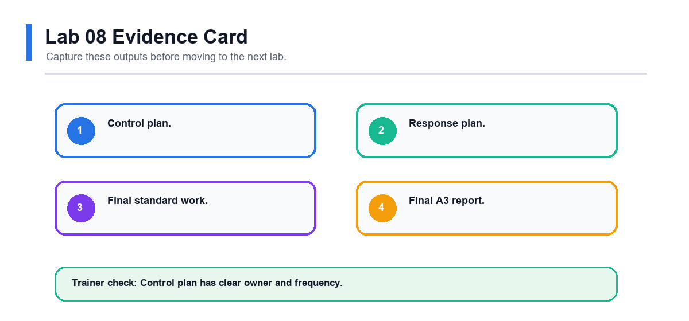

### Review Questions

1. Why do improvements fade after project closure?
2. What should a response plan include?
3. How does standard work support consistency?
4. Why is A3 useful for project communication?

## Final Project Checklist
- Project selection worksheet, problem statement and goal statement.
- SIPOC, current-state process map and waste analysis.
- Stakeholder analysis, facilitation agenda, Kaizen plan and A3 report.
- Data collection plan, baseline data, run chart, Pareto chart and statistics worksheet.
- Fishbone, 5 Whys, FMEA and prioritized root causes.
- Countermeasure plan, 5S/Kanban/poka-yoke ideas, standard work and control plan.

